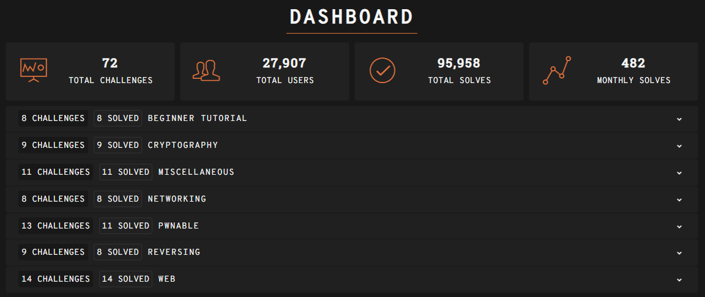

# 247CTF Challenges - Organized by Category

Platform: https://247ctf.com/dashboard



---

## Structure


```
247CTF/
├── crypto/          (7 challenges)  - Cryptography
├── web/             (4 challenges)  - Web Exploitation
├── pwn/             (12 challenges) - Binary Exploitation
├── reversing/       (5 challenges)  - Reverse Engineering
├── network/         (6 challenges)  - Network & Protocols
└── misc/            (3 challenges)  - Miscellaneous
```

---

## Crypto (7 challenges)

| Challenge | Type |
|-----------|------|
| hmac_forge | HMAC Manipulation |
| exclusive_key | XOR Cipher |
| not_my_modulus | RSA Attack |
| suspicious_caesar_cipher | RSA with Caesar Twist |
| nonexistent_functionality | Padding Oracle Attack |
| spn_challenge | Substitution-Permutation Network |
| predictable_iv | IV Prediction |

---

## Web (4 challenges)

| Challenge | Type |
|-----------|------|
| meme_upload | File Upload Exploit |
| wasm_secret | WebAssembly Reversing |
| mturk | Web Logic Flaw |
| flag_auth | Authentication Bypass |

---

## Pwn (12 challenges)

| Challenge | Type |
|-----------|------|
| cookiemonster | Stack Canary Bypass (Buffer Overflow) |
| confused_env_read | Environment Variable Read |
| confused_environment_write | Environment Variable Write |
| empty_read | Buffer Mismanagement |
| executable_stack | Shellcode Injection |
| flag_store | Heap/Stack Exploit |
| heaped_notes | Heap Exploitation |
| hidden_flag_function | Hidden Function Call |
| hidden_flag_function_simple | ret2win |
| less_confused_environment_write | Environment Exploit |
| non_executable_stack | ROP Chain |
| stack_pivot | Stack Pivot Technique |

---

## Reversing (5 challenges)

| Challenge | Type |
|-----------|------|
| angry_revers | Binary Analysis |
| encrypted_usb | Encryption Analysis |
| flag_api_key | API Key Extraction |
| flag_bootloader | Bootloader Analysis |
| flag_keygen | Keygen Reversing |

---

## Network (6 challenges)

| Challenge | Type |
|-----------|------|
| commutative_payload | PCAP Analysis (SMB/XOR) |
| icmp_error | ICMP Protocol Analysis |
| multiplication_tables | Network Logic/Math |
| webshell | Shell Upload/Injection |
| follow_the_sequence | Algorithm Reversing |
| 00ps_my_wifi_disconnected | 00ps, my WiFi disconnected |

---

## Misc (3 challenges)

| Challenge | Type |
|-----------|------|
| completely_turing | Brainfuck/Turing-complete Programming |
| flag_canary | Flag Canary |
| leaky_libraries | Library Leak |
