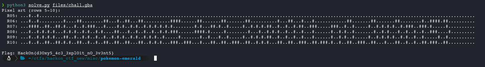

# Desoxy

**Category:** MISC
**Flag:** `HackOn{d3Oxy5_4c3_3xplO1t_nO_3v3nt5}`

## Description

> A modified Pokemon Emerald ROM (`chall.gba`) and save file (`chall.sav`) are provided.

## TL;DR

The ROM hack contains 56 custom maps. Map 33 is a massive 170x20 tilemap that encodes the flag as pixel art using two metatile types (binary on/off). An NPC on that map hints: "P.D. No hay ceros" (no zeros): meaning circle shapes are uppercase 'O', not digit '0', and figure-8 shapes are digit '3', not letter 'e'.

## Analysis

**No emulator needed.** The entire challenge is solved by static analysis of the ROM. No need for mGBA, the save file (`chall.sav`), or running the game. Pokemon Emerald's data structures are public and well-documented; it suffices to parse map headers directly from the binary.

### ROM reconnaissance

The ROM is a 16 MB hack. **`strings` doesn't work** with Pokemon GBA ROMs. Gen III's text engine uses a proprietary character table (A=0xBB, a=0xD5, 0=0xA1, etc.), not ASCII. To search for text, it must first be encoded with that table.

Searching for "Hack" encoded in the Pokemon table (`0xC2 0xD5 0xD7 0xDF`) locates a decoy flag at offset `0x2680FC`:

```python
# Search with Pokemon Gen3 encoding
>>> rom.find(bytes([0xC2, 0xD5, 0xD7, 0xDF]))  # "Hack" in Pokemon table
0x2680fc  # → decoded: "HackOn{flagcorrectahasganado}" (decoy flag, NPC dialogue)
```

This flag is a *red herring*. An NPC on Map 33 also has the dialogue `"P.D. No hay ceros"`, discovered by parsing the map's event scripts (or by playing the ROM hack in an emulator). However, **this hint is not strictly necessary**. The O/0 and 3/e ambiguity is equally resolved by l33tspeak context (see Step 6).

### Locating the custom maps

Pokemon Emerald stores map headers as an array of 28-byte structs. Comparing against known vanilla ROM offsets, custom injected content is identified starting at `0x4872A0`:

```bash
# Search for valid map header patterns (consecutive 0x08XXXXXX pointers)
$ r2 -q -c 'pxw 112 @ 0x4872A0' chall.gba
0x004872a0  0x0848386c 0x0853f584 0x082c8da0 0x00000000  ...  # Map 0
0x004872b0  ...                                                # Map 1
...
```

There are 56 custom map headers. Iterating over them and reading the `width x height` field of each MapLayout, one stands out:

| Map | Width | Height | Notes |
|-----|-------|--------|-------|
| 0   | 30    | 20     | Area with NPCs |
| 1   | 20    | 20     | Normal |
| ...   | ...    | ...     | ... |
| **33**  | **170**   | **20**     | **Abnormally wide: canvas?** |

A 170x20 map in Pokemon Emerald makes no sense as a playable area. It is a canvas for encoding data.

### Map 33: tilemap analysis

Reading the 3400 metatile IDs (`170 * 20` u16 entries) from map 33, only **two values** appear: metatile `1` and metatile `4`.

```python
# Verification:
>>> sorted(set(tiles))
[1, 4]
>>> tiles.count(1), tiles.count(4)
(3114, 286)
```

This is a **binary bitmap**: metatile 4 = pixel ON, metatile 1 = pixel OFF. The readable text is in **rows 5-10** (6 rows tall), forming 36 pixel art characters.

### NPC hint and glyph ambiguity

The NPC dialogue `"P.D. No hay ceros"` (stored in Pokemon encoding, not ASCII) is found in Map 33's event scripts. It is relevant because in this pixel font two pairs of characters share identical bitmaps:

**"Circle" glyph** (appears at positions 4, 9, 22, 27):
```
.##.
#..#
#..#
#..#
.##.
```
Could be: `O`, `o`, or `0`. **"No hay ceros"** (no zeros) → these are all uppercase **`O`**.

**"Figure-8" glyph** (appears at positions 8, 16, 18, 29, 31):
```
.##.
#..#
..#.
#..#
.##.
```
Could be: `3` or `e`. In l33tspeak context: "d3oxys_4c3_3xplo1t" → these are digit **`3`**.

## Solution

### Prerequisites

```bash
pip install pwntools --break-system-packages
```

### How to navigate the ROM binary

Pokemon Emerald (GBA) stores map data as a hierarchy of structures. All pointers in the ROM use the GBA address space where ROM starts at `0x08000000`, so to convert a pointer to a file offset: `file_offset = pointer - 0x08000000`.

#### Locate the Map Header

The ROM hack injects 56 custom map headers as an array starting at `0x4872A0`. Each header is 28 bytes:

```
Offset  Size  Field
0x00    4     layout_ptr       → pointer to MapLayout struct
0x04    4     events_ptr       → pointer to events/warps
0x08    4     scripts_ptr      → pointer to map scripts
0x0C    4     connections_ptr  → pointer to connections (0 = none)
0x10    2     music_id
0x12    2     map_layout_id
0x14    1     region_map_section
...
```

Map 33 is at offset `0x4872A0 + 33 * 28 = 0x48763C`. Reading its header:

```
layout_ptr = 0x084838FC  →  file offset 0x4838FC
```

#### Parse the Layout Structure

The `MapLayout` at `0x4838FC` (16 bytes):

```
Offset  Size  Field
0x00    4     width          = 170
0x04    4     height         = 20
0x08    4     border_ptr     = 0x08481E64
0x0C    4     map_data_ptr   = 0x08481E6C  →  file offset 0x481E6C
```

A 170x20 map is abnormally large for Pokemon Emerald (normal maps are ~20x20). This is clearly a canvas.

#### Read the Metatile Grid

Starting at `0x481E6C`, there are 3400 metatile entries (170 * 20), each a `u16` in little-endian. The lower 10 bits are the metatile ID, upper 6 bits encode layer/collision flags.

Only two unique IDs appear:
- **1** (background): 3114 tiles
- **4** (foreground): 286 tiles

This is a binary bitmap: metatile 4 = pixel ON, metatile 1 = pixel OFF.

#### Extract the Pixel Art

The flag text is drawn in **rows 5 through 10** (6 rows of 170 columns). Rendering metatile 4 as `#` and 1 as `.`:

```
Row  5: ...#..#...........................................................................
Row  6: ...#..#.........#....##........##...#..##...##..........####......##.......##.......
Row  7: ...####..##..##.#...#..#.###...#....#.#..#.#..#.#.#.#.#.#........#.#...##.#..#.....
Row  8: ...#..#.#.#.#...#.#.#..#.#..#.#....##...#..#..#..#..#.#.###......####.#.....#......
Row  9: ...#..#.#.#.#...##..#..#.#..#..#..#.#.#..#.#..#.#.#..#.....#.......#..#...#..#....
Row 10: ...#..#..##..##.#.#..##..#..#..##..##..##...##..#.#.#...###..###...#...##..##..###.
           H   a  c  k  O   n  {  d  3   O  x  y  5  _  4  c  3  _  3  x  p l  O  1  t  ...
```

#### Segment into Characters

Scanning each column for any foreground pixel in rows 5-10, contiguous groups of "active" columns form individual characters, separated by blank (all-background) columns:

| Idx | Cols      | W | Bitmap                         | Char |
|-----|-----------|---|--------------------------------|------|
| 0   | [3-7)     | 4 | `#..# / #..# / #### / #..# / #..# / #..#` | H |
| 1   | [8-11)    | 3 | `... / ... / .## / #.# / #.# / .##`       | a |
| 2   | [12-15)   | 3 | `... / ... / .## / #.. / #.. / .##`        | c |
| 3   | [16-19)   | 3 | `... / #.. / #.. / #.# / ##. / #.#`        | k |
| 4   | [20-24)   | 4 | `.... / .##. / #..# / #..# / #..# / .##.` | O |
| 5   | [25-29)   | 4 | `.... / .... / ###. / #..# / #..# / #..#` | n |
| 6   | [30-33)   | 3 | `... / .## / .#. / #.. / .#. / .##`        | { |
| 7   | [34-37)   | 3 | `... / ..# / ..# / .## / #.# / .##`       | d |
| 8   | [38-42)   | 4 | `.... / .##. / #..# / ..#. / #..# / .##.` | 3 |
| 9   | [43-47)   | 4 | `.... / .##. / #..# / #..# / #..# / .##.` | O |
| 10  | [48-51)   | 3 | `... / ... / #.# / .#. / #.# / #.#`       | x |
| 11  | [52-55)   | 3 | `... / ... / #.# / #.# / .#. / #..`       | y |
| 12  | [56-60)   | 4 | `.... / #### / #... / ###. / ...# / ###.` | 5 |
| 13  | [61-64)   | 3 | `... / ... / ... / ... / ... / ###`        | _ |
| 14  | [65-69)   | 4 | `.... / .##. / #.#. / #### / ..#. / ..#.` | 4 |
| 15  | [70-73)   | 3 | `... / ... / .## / #.. / #.. / .##`        | c |
| 16  | [74-78)   | 4 | `.... / .##. / #..# / ..#. / #..# / .##.` | 3 |
| 17  | [79-82)   | 3 | `... / ... / ... / ... / ... / ###`        | _ |
| 18  | [83-87)   | 4 | `.... / .##. / #..# / ..#. / #..# / .##.` | 3 |
| 19  | [88-91)   | 3 | `... / ... / #.# / .#. / #.# / #.#`       | x |
| 20  | [92-95)   | 3 | `... / ... / ##. / #.# / ##. / #..`        | p |
| 21  | [96-98)   | 2 | `.. / #. / #. / #. / #. / ##`              | l |
| 22  | [99-103)  | 4 | `.... / .##. / #..# / #..# / #..# / .##.` | O |
| 23  | [104-107) | 3 | `... / .#. / ##. / .#. / .#. / ###`        | 1 |
| 24  | [108-111) | 3 | `... / .#. / ### / .#. / .#. / .##`        | t |
| 25  | [112-115) | 3 | `... / ... / ... / ... / ... / ###`        | _ |
| 26  | [116-120) | 4 | `.... / .... / ###. / #..# / #..# / #..#` | n |
| 27  | [121-125) | 4 | `.... / .##. / #..# / #..# / #..# / .##.` | O |
| 28  | [126-129) | 3 | `... / ... / ... / ... / ... / ###`        | _ |
| 29  | [130-134) | 4 | `.... / .##. / #..# / ..#. / #..# / .##.` | 3 |
| 30  | [135-138) | 3 | `... / ... / #.# / .#. / #.# / #.#`       | v |
| 31  | [139-143) | 4 | `.... / .##. / #..# / ..#. / #..# / .##.` | 3 |
| 32  | [144-148) | 4 | `.... / .... / ###. / #..# / #..# / #..#` | n |
| 33  | [149-152) | 3 | `... / .#. / ### / .#. / .#. / .##`        | t |
| 34  | [153-157) | 4 | `.... / #### / #... / ###. / ...# / ###.` | 5 |
| 35  | [158-161) | 3 | `... / #.# / .#. / ..# / .#. / #.#`       | } |


### Solve Script

```python
#!/usr/bin/env python3
"""solve.py — Pokemon Emerald ROM hack CTF solver

Extracts the flag hidden as pixel art in a custom tilemap (Map 33).
The map is a 170x20 grid using only metatile 1 (off) and 4 (on),
forming 6-row-tall bitmap characters in rows 5-10.
"""
from pwn import *
import sys

context.log_level = "info"

rom_path = sys.argv[1] if len(sys.argv) > 1 else "files/chall.gba"
rom = read(rom_path)
log.info(f"ROM loaded: {len(rom)} bytes ({len(rom)/1024/1024:.1f} MB)")

# ============================================================
# STEP 1: Parse Map 33 header
# ============================================================
# The ROM hack injects custom map headers as an array at 0x4872A0.
# Each header is 28 bytes. Map 33 = 0x4872A0 + 33*28 = 0x48763C.
#
# Map header structure (28 bytes):
#   +0x00  u32  layout_ptr      → MapLayout struct
#   +0x04  u32  events_ptr
#   +0x08  u32  scripts_ptr
#   +0x0C  u32  connections_ptr
#   +0x10  u16  music_id
#   +0x12  u16  map_layout_id
#   ...

MAP33_HDR = 0x48763C
layout_ptr = u32(rom[MAP33_HDR : MAP33_HDR + 4])
# GBA ROM pointers use 0x08000000 base; subtract to get file offset
layout_off = layout_ptr - 0x08000000
log.info(f"Map 33 header @ 0x{MAP33_HDR:06X}")
log.info(f"  layout_ptr = 0x{layout_ptr:08X} → file offset 0x{layout_off:06X}")

# ============================================================
# STEP 2: Parse the MapLayout structure
# ============================================================
# MapLayout structure (16 bytes):
#   +0x00  u32  width
#   +0x04  u32  height
#   +0x08  u32  border_ptr
#   +0x0C  u32  map_data_ptr    → array of u16 metatile entries

width = u32(rom[layout_off : layout_off + 4])          # 170
height = u32(rom[layout_off + 4 : layout_off + 8])      # 20
map_data_ptr = u32(rom[layout_off + 12 : layout_off + 16])
map_data_off = map_data_ptr - 0x08000000                 # 0x481E6C

log.info(f"Layout @ 0x{layout_off:06X}: {width}x{height} = {width*height} metatiles")
log.info(f"  map_data_ptr = 0x{map_data_ptr:08X} → file offset 0x{map_data_off:06X}")
log.info(f"  map data occupies {width*height*2} bytes ({width*height} x u16)")

# ============================================================
# STEP 3: Read the metatile grid
# ============================================================
# Each metatile entry is u16 little-endian:
#   bits [0:9]   = metatile ID (0-1023)
#   bits [10:11] = collision
#   bits [12:15] = elevation/layer
#
# In this map, only two IDs are used:
#   1 = background (pixel OFF)
#   4 = foreground (pixel ON)
# This makes the tilemap a binary bitmap.

tiles = []
for i in range(width * height):
    off = map_data_off + i * 2
    tile_id = u16(rom[off : off + 2]) & 0x3FF  # lower 10 bits
    tiles.append(tile_id)

# Verify the binary nature
unique_ids = sorted(set(tiles))
log.info(f"Unique metatile IDs: {unique_ids}")
assert unique_ids == [1, 4], "Expected only metatile 1 (bg) and 4 (fg)"

# ============================================================
# STEP 4: Render the pixel art (rows 5-10)
# ============================================================
# The flag text is drawn in 6 rows (indices 5-10 of the 20-row map).
# Rows 0-4 and 11-19 are empty borders.

TEXT_ROWS = range(5, 11)  # 6 rows tall
FG_TILE = 4               # metatile 4 = pixel ON

log.info("Pixel art (rows 5-10, '#'=ON '.'=OFF):")
for row in TEXT_ROWS:
    line = ""
    for col in range(width):
        line += "#" if tiles[row * width + col] == FG_TILE else "."
    log.info(f"  R{row:02d}: {line}")

# ============================================================
# STEP 5: Segment into individual characters
# ============================================================
# Scan each column for any foreground pixel in the text rows.
# Contiguous groups of "active" columns form one character each,
# separated by all-background columns (the inter-character gap).

cols_active = []
for col in range(width):
    has_fg = any(tiles[row * width + col] == FG_TILE for row in TEXT_ROWS)
    cols_active.append(has_fg)

char_bounds = []  # list of (start_col, end_col)
in_char = False
start = 0
for col in range(width):
    if cols_active[col] and not in_char:
        start = col
        in_char = True
    elif not cols_active[col] and in_char:
        char_bounds.append((start, col))
        in_char = False
if in_char:
    char_bounds.append((start, width))

log.info(f"Found {len(char_bounds)} character groups")

# ============================================================
# STEP 6: Define glyph templates and match
# ============================================================
# Each glyph is defined as a set of (row, col) coordinates where
# pixels are ON, with (0,0) = top-left of the character's bounding box.
#

GLYPHS = {
    # === UPPERCASE (full height, starts at row 0 or 1) ===
    "H": {(0,0),(0,3),(1,0),(1,3),(2,0),(2,1),(2,2),(2,3),
           (3,0),(3,3),(4,0),(4,3),(5,0),(5,3)},               # w=4

    "O": {(1,1),(1,2),(2,0),(2,3),(3,0),(3,3),
           (4,0),(4,3),(5,1),(5,2)},                            # w=4, circle

    # === LOWERCASE (start at row 1-2, shorter) ===
    "a": {(2,1),(2,2),(3,0),(3,2),(4,0),(4,2),(5,1),(5,2)},    # w=3
    "c": {(2,1),(2,2),(3,0),(4,0),(5,1),(5,2)},                # w=3
    "d": {(1,2),(2,2),(3,1),(3,2),(4,0),(4,2),(5,1),(5,2)},    # w=3
    "k": {(1,0),(2,0),(3,0),(3,2),(4,0),(4,1),(5,0),(5,2)},    # w=3
    "l": {(1,0),(2,0),(3,0),(4,0),(5,0),(5,1)},                # w=2
    "n": {(2,0),(2,1),(2,2),(3,0),(3,3),(4,0),(4,3),(5,0),(5,3)},  # w=4
    "p": {(2,0),(2,1),(3,0),(3,2),(4,0),(4,1),(5,0)},          # w=3
    "t": {(1,1),(2,0),(2,1),(2,2),(3,1),(4,1),(5,1),(5,2)},    # w=3
    "v": {(2,0),(2,2),(3,0),(3,2),(4,0),(4,2),(5,1)},          # w=3
    "x": {(2,0),(2,2),(3,1),(4,0),(4,2),(5,0),(5,2)},          # w=3
    "y": {(2,0),(2,2),(3,0),(3,2),(4,1),(5,0)},                # w=3

    # === DIGITS ===
    "1": {(1,1),(2,0),(2,1),(3,1),(4,1),(5,0),(5,1),(5,2)},    # w=3
    "3": {(1,1),(1,2),(2,0),(2,3),(3,2),(4,0),(4,3),(5,1),(5,2)},  # w=4, figure-8
    "4": {(1,1),(1,2),(2,0),(2,2),(3,0),(3,1),(3,2),(3,3),
           (4,2),(5,2)},                                        # w=4
    "5": {(1,0),(1,1),(1,2),(1,3),(2,0),(3,0),(3,1),(3,2),
           (4,3),(5,0),(5,1),(5,2)},                            # w=4

    # === PUNCTUATION ===
    "{": {(1,1),(1,2),(2,1),(3,0),(4,1),(5,1),(5,2)},          # w=3
    "}": {(1,0),(1,1),(2,1),(3,2),(4,1),(5,0),(5,1)},          # w=3
    "_": {(5,0),(5,1),(5,2)},                                   # w=3, only bottom row
}


def extract_bitmap(start_col, end_col):
    """Extract the set of (row, col) ON-pixel positions for a character,
    where row is relative to TEXT_ROWS[0] and col relative to start_col."""
    pts = set()
    for row_idx, row in enumerate(TEXT_ROWS):
        for c in range(start_col, end_col):
            if tiles[row * width + c] == FG_TILE:
                pts.add((row_idx, c - start_col))
    return pts


def match_glyph(bitmap):
    """Match a bitmap against all glyph templates using Jaccard similarity
    (intersection / union). Returns (best_char, score)."""
    best_score = -1
    best_char = "?"
    for ch, glyph in GLYPHS.items():
        intersection = len(bitmap & glyph)
        union = len(bitmap | glyph)
        score = intersection / union if union > 0 else 0
        if score > best_score:
            best_score = score
            best_char = ch
    return best_char, best_score


# ============================================================
# STEP 7: Decode all 36 characters
# ============================================================
decoded = []
for i, (sc, ec) in enumerate(char_bounds):
    bitmap = extract_bitmap(sc, ec)
    ch, score = match_glyph(bitmap)
    log.info(f"  Char {i:2d}: cols [{sc:3d}-{ec:3d})  w={ec-sc}  → '{ch}'  (score={score:.2f})")
    decoded.append(ch)

flag = "".join(decoded)
log.success(f"Flag: {flag}")

# Save
write("flag.txt", (flag + "\n").encode())
log.info("Saved to flag.txt")
```

### Output

```
[*] ROM loaded: 16777216 bytes (16.0 MB)
[*] Map 33 header @ 0x48763C
[*]   layout_ptr = 0x084838FC → file offset 0x4838FC
[*] Layout @ 0x4838FC: 170x20 = 3400 metatiles
[*]   map_data_ptr = 0x08481E6C → file offset 0x481E6C
[*]   map data occupies 6800 bytes (3400 x u16)
[*] Unique metatile IDs: [1, 4]
[*] Pixel art (rows 5-10, '#'=ON '.'=OFF):
[*]   R05: ...#..#...
[*]   R06: ...#..#.........#....##........##...#..##...##...
[*]   R07: ...####..##..##.#...#..#.###...#....#.#..#.#..#...
[*]   ...
[*] Found 36 character groups
[*]   Char  0: cols [  3-  7)  w=4  → 'H'  (score=1.00)
[*]   Char  1: cols [  8- 11)  w=3  → 'a'  (score=1.00)
[*]   Char  2: cols [ 12- 15)  w=3  → 'c'  (score=1.00)
[*]   Char  3: cols [ 16- 19)  w=3  → 'k'  (score=1.00)
[*]   Char  4: cols [ 20- 24)  w=4  → 'O'  (score=1.00)
[*]   Char  5: cols [ 25- 29)  w=4  → 'n'  (score=1.00)
[*]   Char  6: cols [ 30- 33)  w=3  → '{'  (score=1.00)
[*]   Char  7: cols [ 34- 37)  w=3  → 'd'  (score=1.00)
[*]   Char  8: cols [ 38- 42)  w=4  → '3'  (score=1.00)
[*]   ...
[+] Flag: HackOn{d3Oxy5_4c3_3xplO1t_nO_3v3nt5}
[*] Saved to flag.txt
```

## Flag

```
HackOn{d3Oxy5_4c3_3xplO1t_nO_3v3nt5}
```

## PoC


