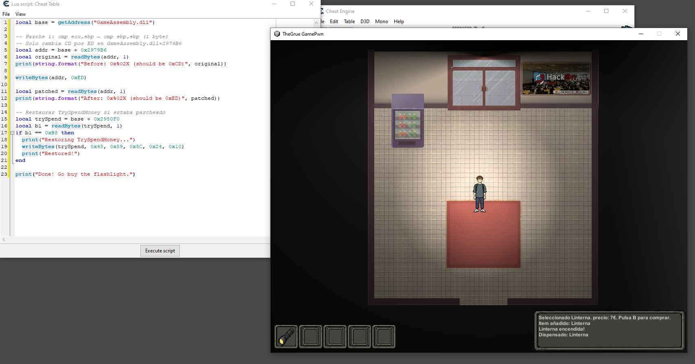
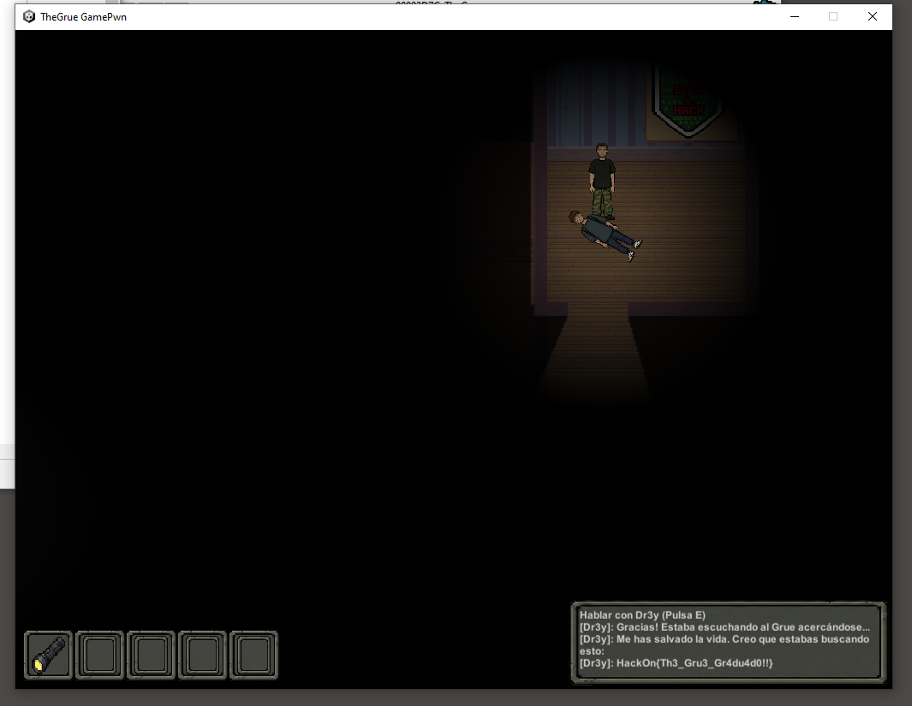
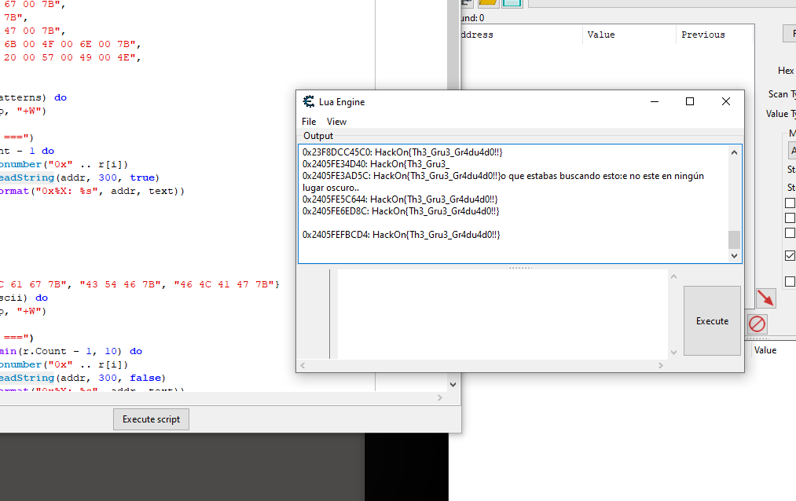

# TheGrue - HackOn CTF Writeup

**Challenge:** TheGrue
**Category:** Misc / GamePwn
**Points:** 387
**Author:** Znati
**Platform:** HackOn
**Flag:** `HackOn{Th3_Gru3_Gr4du4d0!!}`

---

## Description

> The Grue es un monstruo legendario, famoso por habitar la oscuridad absoluta y devorar a los aventureros.
>
> Nos hemos quedado sin electricidad en la URJC y he perdido a mis amigos, es peligroso estar por ahí sin luz. Tengo que hacer todo lo posible para encontrarlos antes de que lo haga The Grue o podría pasar lo peor.

A `TheGrue.zip` file is provided containing a game developed in Unity.

---

## Reconnaissance

### Engine and backend identification

After extracting the archive, the game structure reveals it is a Unity project compiled with the **IL2CPP** backend:

```
TheGrue/
├── TheGrue.exe
├── GameAssembly.dll          ← Native binary (compiled game logic)
├── TheGrue_Data/
│   └── il2cpp_data/
│       └── Metadata/
│           └── global-metadata.dat  ← Metadata with types, strings and offsets
```

The presence of `GameAssembly.dll` instead of `Assembly-CSharp.dll` confirms the game uses **IL2CPP** rather than Mono. This means the original C# code has been compiled to native code (C++), making direct reversing harder, but the metadata still contains the necessary information to reconstruct the structures.

### Metadata extraction with Il2CppDumper

We use [Il2CppDumper](https://github.com/Perfare/Il2CppDumper) to extract type, method and string information:

```powershell
.\Il2CppDumper.exe ..\GameAssembly.dll `
    ..\TheGrue_Data\il2cpp_data\Metadata\global-metadata.dat output/
```

```
Initializing metadata...
Metadata Version: 31
Initializing il2cpp file...
Il2Cpp Version: 31
Searching...
Change il2cpp version to: 29
CodeRegistration : 181035060
MetadataRegistration : 181226650
Dumping...
Done!
```

Il2CppDumper generates several key files:

- `dump.cs`: Declarations of all classes with their offsets (RVA).
- `stringliteral.json`: Hardcoded game strings.
- `script.json`: For importing into Ghidra/IDA with resolved names.

---

## Static Analysis

### Game namespaces

Filtering custom namespaces in `dump.cs`:

```powershell
grep -n "// Namespace:" dump.cs | grep -i "Gamepwn"
```

We find the game architecture under the **Gamepwn** namespace:

| Namespace | Classes |
|---|---|
| `Gamepwn.Core` | GameManager, InventorySystem, ItemDatabase, MoneyManager, Item, Interactable |
| `Gamepwn.Player` | PlayerController |
| `Gamepwn.Environment` | DavidNPC, Door, GrueTrigger, Pickup, VendingMachine, SignInteractable, TVInteractable |
| `Gamepwn.UI` | GameLogger, InventoryUI |

### VendingMachine: Attack vector

```csharp
// Namespace: Gamepwn.Environment
public class VendingMachine : Interactable
{
    [Header("Vulnerability A Logic")]    // ← Author's hint
    public int selectedItemID;            // 0x20
    private int _transactionPrice;        // 0x24
    private bool _isPlayerInRange;        // 0x28

    // RVA: 0x2978C0
    public void BuyInput() { }

    // RVA: 0x297EC0
    public void SelectItem(int itemId) { }
}
```

The header `"Vulnerability A Logic"` is a direct hint from the author indicating that the vending machine contains an exploitable vulnerability.

### MoneyManager: Obfuscated money

```csharp
public class MoneyManager : MonoBehaviour
{
    private ObfuscatedInt _currentMoney;   // 0x18: Obfuscated value in memory

    // RVA: 0x294E80
    public int GetMoney() { }

    // RVA: 0x2950F0
    public bool TrySpendMoney(int amount) { }

    // RVA: 0x2951F0
    public void UpdateReserves(int amount, int checksum) { }
}
```

The money is protected via `ObfuscatedInt`, meaning the actual value in memory is XOR-encrypted and cannot be modified directly with a conventional memory scan.

### Relevant strings

From `stringliteral.json` we extract the key messages:

```json
"¡CUIDADO! No entres en habitaciones oscuras sin luz, puedes ser devorado por El Grue."
"Parece que lograste engañar al Grue, pero sin luz no encontrarás nada..."
"Tienes la linterna! El Grue se asusta y escapa!."
"[Dr3y]: Gracias! Estaba escuchando al Grue acercándose..."
"YOU WIN!"
"flag"
```

### Game flow

With all this information, we reconstruct the victory flow:

```
Collect money (Pickup) → Buy flashlight from VendingMachine →
Enter dark room (GrueTrigger) → Rescue Dr3y (DavidNPC) →
GameManager.WinGame() → FLAG
```

The problem is that the player doesn't have enough money to buy the flashlight (price: 7€), which forces us to exploit the vending machine vulnerability.

---

## Dynamic Analysis with Cheat Engine

### BuyInput disassembly

Navigating to `GameAssembly.dll+2978C0`, the disassembly reveals the purchase flow with the money check:

```asm
; --- Deobfuscate money (ObfuscatedInt) ---
mov ecx, [rbx+18]                    ; encrypted value A
mov eax, [rbx+1C]                    ; encrypted value B
xor ecx, eax                         ; real_money = A XOR B

; --- Critical comparison ---
cmp ecx, ebp                         ; real_money vs price
jl  297BFA                            ; ★ if money < price → "Not enough money"
```

The critical line is:

```asm
2979B5: 3B CD     ; cmp ecx, ebp  → compares money (ecx) with price (ebp)
2979B7: 0F 8C ... ; jl 297BFA     → jumps if money < price
```

### CAFEBABE anti-tamper

In addition to the money check, there is an integrity verification that detects if the price has been tampered with in memory:

```asm
297A62: imul rsi, rbp, 5F3759DF    ; hash of price
297A69: mov  eax, CAFEBABE          ; magic constant
297A6E: xor  rsi, rax               ; verification
297A71: je   297BFA                  ; if match → same error path
```

---

## Exploitation

### Strategy: 1-byte patch

Instead of patching with NOPs (which breaks register flow and causes crashes), we apply a direct **single-byte** patch that changes the comparison operand:

```
Before:  3B CD    → cmp ecx, ebp   (money vs price)
After:   3B ED    → cmp ebp, ebp   (price vs price: always equal)
```

By comparing `ebp` against itself, the result is always "equal", so the `jl` (jump if less) is never taken and the purchase always proceeds. The patch doesn't modify data in memory, thus bypassing the CAFEBABE anti-tamper protection.

### Applying the patch with Lua

We use Cheat Engine's Lua console to apply the patch programmatically:

```lua
local base = getAddress("GameAssembly.dll")

-- Patch: cmp ecx,ebp → cmp ebp,ebp (1 byte: CD → ED)
local addr = base + 0x2979B6
writeBytes(addr, 0xED)

print("Patch applied - buy check bypassed")
```

After running the script and pressing the buy button in the game, the flashlight is successfully added to the inventory:


*Lua script applied in Cheat Engine. The game log shows: "Item añadido: Linterna / Linterna encendida! / Dispensado: Linterna"*

---

## Obtaining the flag

With the flashlight equipped, the player can enter the dark room without being devoured by the Grue. Inside, we find the NPC **Dr3y** who gives us the flag upon interaction:



*Dr3y rescued in the dark room. "[Dr3y]: Gracias! ... HackOn{Th3_Gru3_Gr4du4d0!!}"*

### Memory verification

After completing the challenge, the flag can be confirmed by searching process memory with an AOBScan in Cheat Engine's Lua console:



*The flag `HackOn{Th3_Gru3_Gr4du4d0!!}` appears at multiple memory locations after completing the game*

---

## Flag

```
HackOn{Th3_Gru3_Gr4du4d0!!}
```

---

## Tools Used

| Tool | Usage |
|---|---|
| Il2CppDumper | Metadata extraction and dump.cs generation with RVAs |
| Cheat Engine | Dynamic analysis, breakpoints, memory scan and runtime patching |
| PowerShell | String search and metadata file analysis |

## Techniques Summary

- **IL2CPP reversing**: Used Il2CppDumper to recover class structures, methods and RVAs from a Unity native binary.
- **ObfuscatedInt analysis**: Identified the XOR obfuscation scheme (A ⊕ B = real value) for the game's money system.
- **Surgical 1-byte patch**: Modified the `cmp` instruction operand (`CD` → `ED`) to alter the comparison without breaking execution flow or triggering the CAFEBABE anti-tamper.
- **Memory scanning with AOBScan**: Searched for UTF-16LE strings to locate Item objects in memory and confirm their properties.
- **Anti-tamper bypass**: Evaded the CAFEBABE protection by modifying the comparison instruction rather than the data in memory.
