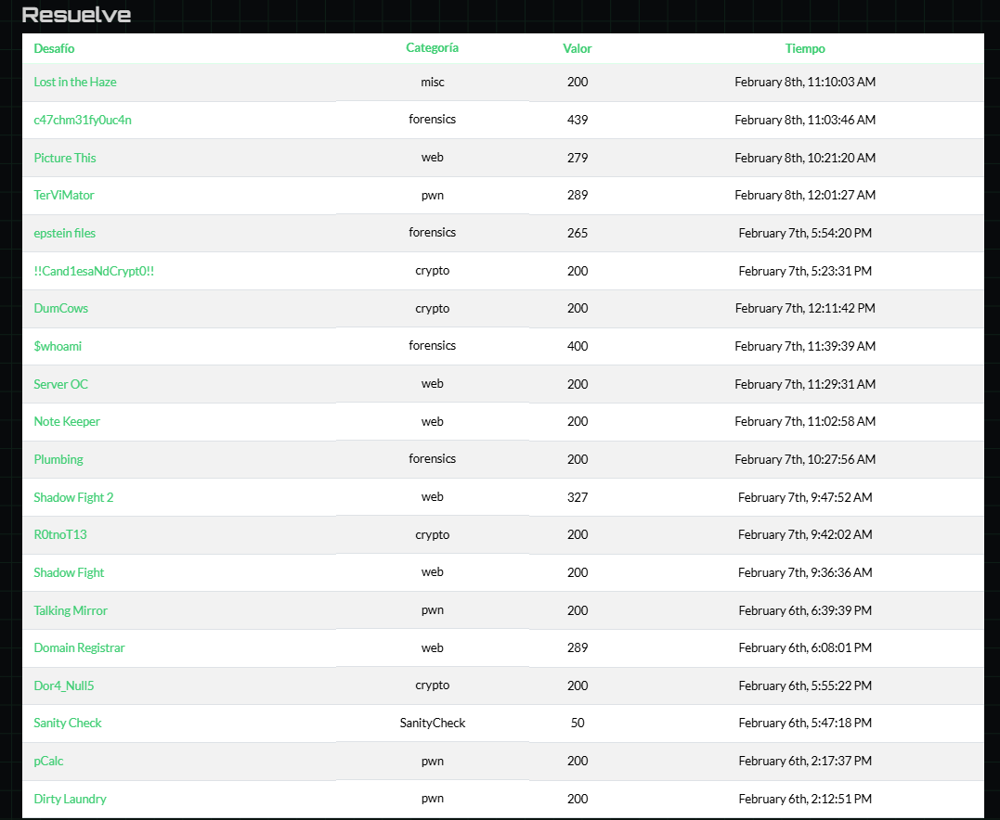

# Pragyan CTF 2026 - Writeups

Writeups for challenges solved during Pragyan CTF 2026 (February 6-8, 2026).

<pre>
pragyan_ctf_2026/
│
├── pwn/
│   ├── <a href="pwn/dirty_laundry/WRITEUP_english.md">dirty_laundry/</a>
│   │   ├── Binary exploitation with buffer overflow and ROP chain
│   │   ├── Learn: Stack buffer overflow, ret2libc, ROP gadgets
│   │   └── <a href="pwn/dirty_laundry/WRITEUP_english.md">📄 Writeup</a> | <a href="pwn/dirty_laundry/exploit.py">💻 Exploit</a>
│   ├── <a href="pwn/pcalc/WRITEUP_english.md">pcalc/</a>
│   │   ├── Python jail escape via chained vulnerabilities
│   │   ├── Learn: F-string AST bypass, object hierarchy, audit hook bypass
│   │   └── <a href="pwn/pcalc/WRITEUP_english.md">📄 Writeup</a> | <a href="pwn/pcalc/exploit.py">💻 Exploit</a>
│   ├── <a href="pwn/talking_mirror/WRITEUP_english.md">talking_mirror/</a>
│   │   ├── Format string vulnerability with indirect write via RBP chain
│   │   ├── Learn: Format string exploitation, RBP chain indirection, GOT overwrite
│   │   └── <a href="pwn/talking_mirror/WRITEUP_english.md">📄 Writeup</a> | <a href="pwn/talking_mirror/solve.py">💻 Exploit</a>
│   └── <a href="pwn/TerviMator/WRITEUP_english.md">TerviMator/</a>
│       ├── Virtual machine bytecode exploitation via sign extension bug
│       ├── Learn: Sign extension exploit, arbitrary write, pointer patching
│       └── <a href="pwn/TerviMator/WRITEUP_english.md">📄 Writeup</a> | <a href="pwn/TerviMator/exploit_aslr.py">💻 Exploit</a>
│
├── web/
│   ├── <a href="web/domain_registrar/WRITEUP_english.md">domain_registrar/</a>
│   │   ├── Domain registration service with SSRF vulnerability
│   │   ├── Learn: SSRF, internal service access
│   │   └── <a href="web/domain_registrar/WRITEUP_english.md">📄 Writeup</a>
│   ├── <a href="web/shadow_fight/WRITEUP_english.md">shadow_fight/</a>
│   │   ├── XSS challenge with closed Shadow DOM bypass
│   │   ├── Learn: Shadow DOM bypass, split-comment XSS, window.find()
│   │   └── <a href="web/shadow_fight/WRITEUP_english.md">📄 Writeup</a> | <a href="web/shadow_fight/exploit.py">💻 Exploit</a>
│   ├── <a href="web/shadow_fight/WRITEUP_english.md">shadow_fight_2/</a>
│   │   ├── Advanced XSS with split-comment technique
│   │   ├── Learn: Split-comment XSS (/* and */ in different params)
│   │   └── <a href="web/shadow_fight/WRITEUP_english.md">📄 Writeup</a> | <a href="web/shadow_fight/exploit_2.py">💻 Exploit</a>
│   ├── <a href="web/note_keeper/WRITEUP_english.md">note_keeper/</a>
│   │   ├── Next.js middleware bypass chain
│   │   ├── Learn: CVE-2025-29927, CVE-2025-57822, middleware bypass
│   │   └── <a href="web/note_keeper/WRITEUP_english.md">📄 Writeup</a> | <a href="web/note_keeper/exploit.py">💻 Exploit</a>
│   ├── <a href="web/server_oc/WRITEUP_english.md">server_oc/</a>
│   │   ├── Multi-stage web exploitation chain
│   │   ├── Learn: JWT alg=none bypass, prototype pollution, SSRF
│   │   └── <a href="web/server_oc/WRITEUP_english.md">📄 Writeup</a> | <a href="web/server_oc/exploit.py">💻 Exploit</a>
│   ├── <a href="web/picturethis/WRITEUP_english.md">picturethis/</a>
│   │   ├── JPEG polyglot with DOM clobbering
│   │   ├── Learn: JPEG polyglot, DOM clobbering, CDN extension mismatch
│   │   └── <a href="web/picturethis/WRITEUP_english.md">📄 Writeup</a> | <a href="web/picturethis/solve.py">💻 Exploit</a>
│   └── <a href="web/crossing_boundaries/WRITEUP_english.md">crossing_boundaries/</a>  (solved out of time)
│       ├── HTTP Request Smuggling
│       ├── Learn: HTTP request smuggling
│       └── <a href="web/crossing_boundaries/WRITEUP_english.md">📄 Writeup</a>
│
├── crypto/
│   ├── <a href="crypto/dora_nulls/WRITEUP_english.md">dora_nulls/</a>
│   │   ├── Cryptographic puzzle involving null bytes
│   │   ├── Learn: Null byte manipulation, custom cipher analysis
│   │   └── <a href="crypto/dora_nulls/WRITEUP_english.md">📄 Writeup</a> | <a href="crypto/dora_nulls/solve.py">💻 Exploit</a>
│   ├── <a href="crypto/R0tnoT13/WRITEUP_english.md">R0tnoT13/</a>
│   │   ├── State reconstruction from XOR-rotation leaks
│   │   ├── Learn: Linear algebra over GF(2), Z3 constraint solving, ROTL
│   │   └── <a href="crypto/R0tnoT13/WRITEUP_english.md">📄 Writeup</a> | <a href="crypto/R0tnoT13/solve_z3.py">💻 Exploit</a>
│   ├── <a href="crypto/dum_cows/WRITEUP_english.md">dum_cows/</a>
│   │   ├── XOR stream cipher with keystream reuse
│   │   ├── Learn: Known-plaintext attack, keystream extraction
│   │   └── <a href="crypto/dum_cows/WRITEUP_english.md">📄 Writeup</a> | <a href="crypto/dum_cows/solve.py">💻 Exploit</a>
│   └── <a href="crypto/candles_and_cripto/WRITEUP_english.md">candles_and_cripto/</a>
│       ├── Polynomial hash zero attack for signature forgery
│       ├── Learn: Polynomial hash collision, brute force suffix generation
│       └── <a href="crypto/candles_and_cripto/WRITEUP_english.md">📄 Writeup</a> | <a href="crypto/candles_and_cripto/exploit.py">💻 Exploit</a>
│
├── forensics/
│   ├── <a href="forensics/plumbing/WRITEUP_english.md">plumbing/</a>
│   │   ├── Docker forensics challenge
│   │   ├── Learn: Docker layer analysis, file system forensics
│   │   └── <a href="forensics/plumbing/WRITEUP_english.md">📄 Writeup</a>
│   ├── <a href="forensics/whoami/WRITEUP_english.md">whoami/</a>
│   │   ├── Network forensics with NTLMv2 hash cracking
│   │   ├── Learn: NTLMv2 hash extraction, hashcat, timestamp analysis
│   │   └── <a href="forensics/whoami/WRITEUP_english.md">📄 Writeup</a> | <a href="forensics/whoami/exploit.py">💻 Exploit</a>
│   ├── <a href="forensics/epstein_files/WRITEUP_english.md">epstein_files/</a>
│   │   ├── PDF steganography and PGP decryption
│   │   ├── Learn: PDF hidden data, XOR decryption, PGP symmetric encryption, ROT18
│   │   └── <a href="forensics/epstein_files/WRITEUP_english.md">📄 Writeup</a> | <a href="forensics/epstein_files/solve.py">💻 Exploit</a>
│   └── <a href="forensics/c47chm31fy0uc4n/WRITEUP_english.md">c47chm31fy0uc4n/</a>
│       ├── Memory forensics with Volatility3
│       ├── Learn: Volatility3, memory dump analysis, process forensics, heap reconstruction
│       └── <a href="forensics/c47chm31fy0uc4n/WRITEUP_english.md">📄 Writeup</a>
│
└── misc/
    ├── lost_in_the_haze/
    │   └── Miscellaneous challenge
    └── <a href="misc/tac-tic-toe/WRITEUP_english.md">tac-tic-toe/</a>
        ├── WASM patching to defeat unbeatable AI
        ├── Learn: WebAssembly patching, minimax algorithm inversion
        └── <a href="misc/tac-tic-toe/WRITEUP_english.md">📄 Writeup</a> | <a href="misc/tac-tic-toe/solve.js">💻 Exploit</a>
</pre>

---

## Tools & Techniques

### Most Used Tools
- **pwntools** - Binary exploitation
- **Z3 Solver** - Constraint solving
- **Volatility3** - Memory forensics
- **Burp Suite** - Web proxy
- **Hashcat** - Password cracking
- **WABT** - WebAssembly toolkit
