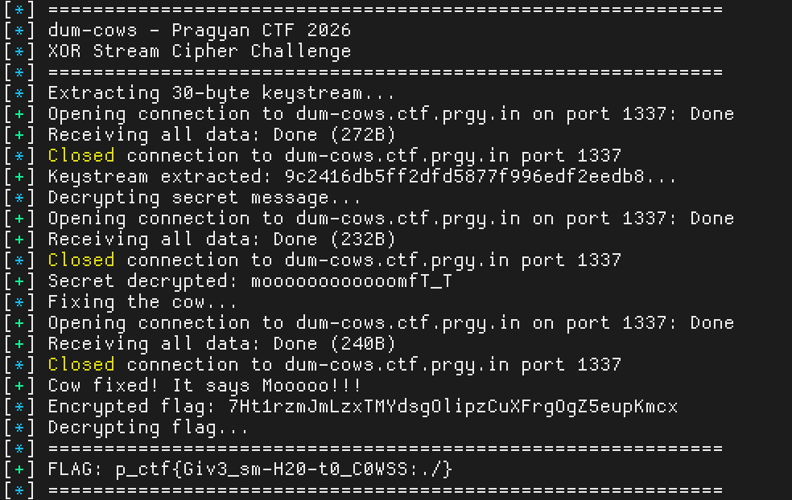

# Dum Cows

**CTF/platform:** Pragyan CTF 2026

**Category:** Crypto

**Difficulty:** Medium

**Description:** Something's wrong with our cow - it can't moo properly! Help fix the cow so it can speak correctly and reveal its encrypted secrets.

**Remote:** `ncat --ssl dum-cows.ctf.prgy.in 1337`

**Flag:** `p_ctf{Giv3_sm-H20-t0_C0WSS:./}`

---

## Analysis

### Initial Observation

Connecting to the server shows a broken cow that says "DURRRRR!!!" instead of "MOOOOO":

```
 _____________________________________________________
Something is wrong…
Fix Me with FIX_COW Command so i can speak MOOOOOOO! >
 _____________________________________________________
        \   ^__^
         \  (oo)\_______
            (__)\       )\/\
                ||----w |
                ||     ||

Give your cow a name:
 ____________
< DURRRRR!!! >
 ------------
        \   ^__^
         \  (oo)\_______
            (__)\       )\/\
                ||----w |
                ||     ||
[Name: Ufrn+w==] says: FfQO0tpcRvvw4QltoUMPy1s9

Give your cow a name:
```

**Key observations:**
1. The cow is broken and needs to be fixed with the "FIX_COW" command
2. Both the name and message are encrypted (Base64 encoded)
3. The encryption appears to be deterministic for certain variants

---

## Vulnerability: Stream Cipher XOR Encryption

### Discovery Process

1. **Testing multiple inputs revealed TWO encryption variants:**
   - Variant A: keystream starting with `9c2416db...`
   - Variant B: keystream starting with `259f948f...`

2. **Empty input correlation test:**
   - Sending empty string `""` as the cow name returns only encrypted messages
   - There are exactly 2 unique encrypted messages (one per variant)
   - Variant A empty msg: `f14b79b4309db0bae810f601b0438becf3bb`
   - Variant B empty msg: `48f0fbe017f40ed2da5c46fbf0e30056917a`

3. **Keystream extraction:**
   - Sending known plaintext (e.g., `"A" * 18`) allows extracting the keystream
   - Name is encrypted with: `encrypted_name = plaintext XOR keystream`
   - Therefore: `keystream = plaintext XOR encrypted_name`

4. **Decrypting the secret message:**

   **Variant A:**
   ```python
   keystream_A = bytes.fromhex("9c2416db5ff2dfd5877f996edf2eedb8acef")
   empty_msg_A = bytes.fromhex("f14b79b4309db0bae810f601b0438becf3bb")

   # XOR to decrypt
   secret = empty_msg_A XOR keystream_A
   # Result: "moooooooooooomfT_T"
   ```

   **Variant B gives the same result:** `"moooooooooooomfT_T"`

---

## Exploitation

### Step 1: Extract Keystream (18 bytes)

Send 18 'A's to get the encryption key:

```python
from pwn import *
import base64

io = remote('dum-cows.ctf.prgy.in', 1337, ssl=True)
io.recvuntil(b'name:')
io.sendline(b'A' * 18)
response = io.recvall(timeout=2).decode()
io.close()

enc_name = response.split("[Name: ")[1].split("]")[0]
name_bytes = base64.b64decode(enc_name)

# Extract keystream
keystream = bytes([0x41 ^ b for b in name_bytes])
# keystream = 9c2416db5ff2dfd5877f996edf2eedb8acef (Variant A)
#          or 259f948f789b61bdb53329949f8e6602ce2e (Variant B)
```

### Step 2: Decrypt Secret Message

Send empty input to get the encrypted secret:

```python
io = remote('dum-cows.ctf.prgy.in', 1337, ssl=True)
io.recvuntil(b'name:')
io.sendline(b'')  # Empty input
response = io.recvall(timeout=2).decode()
io.close()

enc_msg = response.split("says: ")[1].split("\n")[0]
msg_bytes = base64.b64decode(enc_msg)

# Decrypt with keystream
secret = bytes([m ^ k for m, k in zip(msg_bytes, keystream)])
# Result: b"moooooooooooomfT_T"
```

### Step 3: Fix the Cow

Send the magic command with the decrypted secret:

```python
io = remote('dum-cows.ctf.prgy.in', 1337, ssl=True)
io.recvuntil(b'name:')
io.sendline(b'FIX_COW moooooooooooomfT_T')  # Space-separated!
response = io.recvall(timeout=3).decode()
io.close()

print(response)
```

**Output:**
```
 ___________
< Mooooo!!! >
 -----------
        \   ^__^
         \  (oo)\_______
            (__)\       )\/\
                ||----w |
                ||     ||
[!] COW FIXED! THE FLAG SPEAKS:
7Ht1rzmJmLzxTMYdsgOlipzCuXFrgOgZ5eupKmcx
```

### Step 4: Decrypt the Flag

The flag is Base64-encoded and XOR-encrypted:

```python
import base64

enc_flag_b64 = "7Ht1rzmJmLzxTMYdsgOlipzCuXFrgOgZ5eupKmcx"
flag_bytes = base64.b64decode(enc_flag_b64)

# Full keystream (30 bytes) extracted from 30 'A's input
keystream_full = bytes.fromhex(
    "9c2416db5ff2dfd5877f996edf2eedb8acefcd4134c3d84eb6b89304484c5cb1c93374f0c4e780cf8819a0"
)

# Decrypt
flag = bytes([f ^ keystream_full[i] for i, f in enumerate(flag_bytes)])
print(flag.decode())
# p_ctf{Giv3_sm-H20-t0_C0WSS:./}
```

---

## Complete Exploit Script

```python
#!/usr/bin/env python3
from pwn import *
import base64

context.log_level = 'info'

HOST = 'dum-cows.ctf.prgy.in'
PORT = 1337

def extract_keystream(length=30):
    """Extract keystream by sending known plaintext"""
    io = remote(HOST, PORT, ssl=True)
    io.recvuntil(b'name:')
    io.sendline(b'A' * length)
    response = io.recvall(timeout=2).decode()
    io.close()

    enc_name = response.split("[Name: ")[1].split("]")[0]
    name_bytes = base64.b64decode(enc_name)
    keystream = bytes([0x41 ^ b for b in name_bytes])

    return keystream

def decrypt_secret(keystream):
    """Decrypt the secret message with empty input"""
    io = remote(HOST, PORT, ssl=True)
    io.recvuntil(b'name:')
    io.sendline(b'')  # Empty input
    response = io.recvall(timeout=2).decode()
    io.close()

    enc_msg = response.split("says: ")[1].split("\n")[0]
    msg_bytes = base64.b64decode(enc_msg)

    secret = bytes([m ^ k for m, k in zip(msg_bytes, keystream)])
    return secret

def fix_cow(secret):
    """Fix the cow and get encrypted flag"""
    io = remote(HOST, PORT, ssl=True)
    io.recvuntil(b'name:')
    io.sendline(b'FIX_COW ' + secret)
    response = io.recvall(timeout=3).decode()
    io.close()

    # Extract encrypted flag
    enc_flag = response.split("FLAG SPEAKS:\n")[1].strip()
    return enc_flag

def decrypt_flag(enc_flag_b64, keystream):
    """Decrypt the final flag"""
    flag_bytes = base64.b64decode(enc_flag_b64)
    flag = bytes([f ^ keystream[i] for i, f in enumerate(flag_bytes)])
    return flag.decode()

# Main exploit
print("[*] Extracting keystream...")
keystream = extract_keystream(30)
print(f"[+] Keystream: {keystream.hex()}")

print("[*] Decrypting secret message...")
secret = decrypt_secret(keystream[:18])
print(f"[+] Secret: {secret.decode()}")

print("[*] Fixing the cow...")
enc_flag = fix_cow(secret)
print(f"[+] Encrypted flag: {enc_flag}")

print("[*] Decrypting flag...")
flag = decrypt_flag(enc_flag, keystream)
print(f"\n[!] FLAG: {flag}")
```

---

## Key Takeaways

### Cryptography Weaknesses

1. **Reused Keystream:** The server uses only 2 keystream variants that alternate randomly
2. **Known Plaintext Attack:** Sending controlled input allows full keystream extraction
3. **XOR Stream Cipher:** Classic weakness - `plaintext XOR keystream = ciphertext`

### Exploitation Steps

1. Send known plaintext → extract keystream from encrypted name
2. Send empty input → get encrypted secret using same keystream
3. XOR encrypted secret with keystream → recover plaintext secret
4. Send `FIX_COW <secret>` → trigger flag reveal
5. Decrypt Base64+XOR encrypted flag with full keystream

### Lessons Learned

- **Never reuse keystreams** in stream ciphers
- XOR encryption is **trivially broken** with known plaintext
- Deterministic encryption reveals patterns through multiple queries
- "Think simple" - the solution was straightforward XOR cryptanalysis

---

## PoC

### Keystream Extraction



*Screenshot showing the keystream extraction process using known-plaintext attack.*

### Complete Exploit and Flag


*Screenshot showing successful execution of the complete exploit and flag capture.*
